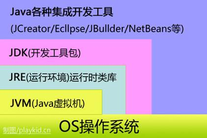

# Java 跨平台原理

 - 编译之后生成平台无关的字节码文件
 - 运行在依赖不同平台的虚拟机（JVM）上

# 配置环境

 - win平台

```powershell
JAVA_HOME = D:\Java\jdk1.7.0
PATH = %JAVA_HOME%\bin
```

 - Linux平台

```powershell
#编辑配置文件
vim /etc/profile
#在配置文件末尾加入：
export JAVA_HOME=/usr/share/jdk1.6.0_14
export PATH=$JAVA_HOME/bin:$PATH
export CLASSPATH=.:$JAVA_HOME/lib/dt.jar:$JAVA_HOME/lib/tools.jar
#使配置文件生效
source /etc/profile
```

# 基本语法

 - Java语言严格区分大小写
 - 一个Java源文件（.java）文件中可以定义多个类，但是**最多只能有一个**public类，且源文件名要与public类名相同
 - 一个源文件可包含多个Java类，成功编译后生成多个字节码文件（.class）,即每个Java类都会生成一个class文件，且字节码文件名与类名相同
 - Java程序的入口为main方法

# 数据类型
## 基本数据类型
Java有8中基本数据类型，如下：

 1. 整数类型：`long、int、short、byte`
 2. 浮点类型：`float、double`
 3. 字符类型：`char`
 4. 布尔类型：`boolean`

| 数据类型         | 占用字节 | 可标识范围                               | 默认值   | 对应包装类 |
| ---------------- | -------- | ---------------------------------------- | -------- | ---------- |
| byte（字节型）   | 8        | -128~127                                 | 0        | Byte       |
| short（短整型）  | 16       | -32768~32767                             | 0        | Short      |
| int（整型）      | 32       | -2147483648~2147483647                   | 0        | Integer    |
| long（长整型）   | 64       | -9223372036854775808~9223372036854775807 | 0        | Long       |
| float（单精度）  | 32       | -3.4E38~3.4E38                           | 0.0      | Float      |
| double（双精度） | 64       | -1.7E308~1.7E308                         | 0.0      | Double     |
| char（字符）     | 16       | 0~255                                    | '\u0000' | Character  |
| boolean（布尔）  | -        | true或false                              | false    | Boolean    |

**注意：**

包装类型默认为null

基本数据类型直接存于JVM栈中的局部变量表中，而包装类型数据对象，对象实例存于堆中。基本数据类型占用空间更小。

## 自动装箱与拆箱

* 装箱：将基本类型用对应的引用数据类型包装起来（调用包装类的`valueOf()`方法）
* 拆箱：将包装数据类型转为基本数据类型（调用`xxxValue()`方法）

例子：

```java
Integer i = 10;  //装箱
int n = i;       //拆箱
```

对应字节码：

```java
 L1

    LINENUMBER 8 L1

    ALOAD 0

    BIPUSH 10

    INVOKESTATIC java/lang/Integer.valueOf (I)Ljava/lang/Integer;

    PUTFIELD AutoBoxTest.i : Ljava/lang/Integer;

   L2

    LINENUMBER 9 L2

    ALOAD 0

    ALOAD 0

    GETFIELD AutoBoxTest.i : Ljava/lang/Integer;

    INVOKEVIRTUAL java/lang/Integer.intValue ()I

    PUTFIELD AutoBoxTest.n : I

    RETURN
```

因此：

* `Integer i = 10` 等价于 `Integer i = Integer.valueOf(10)`
* `int n = i` 等价于 `int n = i.intValue()`;


### 面试点：

1. ==和equals的区别

对于基本数据类型来说，==比较的是值；对于引用数据类型来说，==比较的是对象的内存地址

> Java只有值传递，对于==来说不管是基本数据类型还是引用数据类型，本质都是比较值，引用数据类型变量的值就是对象的内存地址

``equals()``不能作用用于判断基本数据类型的变量，只能用于判断两个对象是否相等。``equals()``方法存于``Object``中，实现如下：

```java
public boolean equals(Object obj) {
     return (this == obj);
}
```

使用场景：

* 类没有覆盖了``equals()``方法：等价于 == ，默认使用的是``Object``中的``equals()``方法
* 类覆盖了``equals()``方法：使用该类中重写的``equals()``方法进行比较，如果属性值相等则返回true（这两个对象相等）

```java
public static void main(String[] args) {

        String a = new String("ab"); // a 为一个引用
        String b = new String("ab"); // b为另一个引用,对象的内容一样
        String aa = "ab"; // 放在常量池中
        String bb = "ab"; // 从常量池中查找
        if (aa == bb) // true
            System.out.println("true");
        if (a == b) // false，非同一对象
            System.out.println("true");
        if (a.equals(b)) // true
            System.out.println("true");
        if (42 == 42.0) { // true
            System.out.println("true");
        }if(aa.equals(bb)){  //true
            System.out.println("true");
        }
    }
```

**说明：**

* String重写了``equals()``方法，所有比较的是对象的值
* 当创建String类型对象时，虚拟机会在常量池中查找是否存在与创建对象值相同的值，如果有则赋给当前引用，如果没有则在常量池中创建新对象


## 封装 

给对象提供了隐藏内部特性和行为的能力

Java中有四种修饰符:default public private protected 每一个修饰符给对象中的属性赋予不同的访问权限

对象中也可以提供一些方法让其他对象进行操作其内部数据(get set)

封装的优点

- 通过隐藏对象的属性来保护对象的状态
- 提高代码的维护性可用性和扩张性
- 禁止对象间的不良交互提高模块化

### 继承

- 子类拥有父类中的非private属性
- 子类继承父类中的方法 并可以对其进行扩展(对于父类中没有方法体的方法 子类需对其进行重写)
- 子类可以拥有自己独有的方法
- Java中的继承是单继承 也可以是多层继承(单继承就是一个子类只能继承一个父类 多继承就是a类继承b类,b类继承c类)
- 继承提高了代码的耦合性

### 多态

多态存在的三个必要条件

　　1.继承

　　2.重写

　　3.父类引用指向子类对象

### 抽象类

- 抽象类不行就行实例化 即不能用new关键字来创建对象
- 类中如果有一个方法是抽象方法(没有方法体) 则此类为抽象类 必须使用abstract修饰 但是抽象类中的方法不一定都是抽象的(接口除外) 这些抽象方法在子类中必须进行重写
- 抽象类就是用来定义规范的 其他类参考这个类中定义的方法进行逻辑代码的实现

### 接口

- 接口是由全局变量和抽象方法(因为是抽象方法所以不能有方法体)所构成的抽象类
- 其实现类必须实现其定义的所以方法(重写 按照功能不能补充不同的方法体)
- 接口可以多实现
- 接口中的变量一定是 **public static final** 的
- 接口中的方法都是 **public abstract** 不能是staic的(static方法必须实现 而抽象方法不能在本类中进行实现)

### 重载和重写

- 重写 就是子类将父类中的方法重新写一遍,在方法名 参数列表 返回类型 (子类函数的访问权限不能少于父类)的情况下对方法体进行修改或是填充

- 重载 在一个类中,同名的方法名(参数类型 个数 不同甚至参数顺序不同) 就是重载 不能通过返回值的类型判断是否为重载


### final关键字

- 被final修饰的类不能被继承
- final类中的成员变量可以根据需求设计为final 成员方法则被隐式指定为final方法
- 修饰方法时 此方法不能被重写
- 修饰变量时必须初始化值 而且只能初始化一次(不能改变)

### static关键字

- 静态方法只能调用静态方法和静态变量(非静态方法可以不需创建对象 直接用类名 . 静态方法或静态变量进行调用)
- 方便在没有创建对象的情况下进行调用方法或变量
- static修饰的方法或变量不依赖对象进行访问,只要类被加载了,就可以通过类名进行访问
- static代码块可以存在于类中的任何地方可以由多个static代码块 ,在类被加载的时候static代码块按照顺序进行执行(只执行一次) 所以可以优化程序性能(很多时候我们将只需进行一次的初始化操作放到static代码块中)

### jdk jre jvm



- jdk Java开发包 包含编译Java程序所必须的编译 运行等开发工具以及jre (jdk包含jre和jvm)
- jre Java运行环境 提供Java程序运行所需要的软件环境 包含jvm和丰富的系统类库(类库即Java提前封装好的功能类,可以直接拿来用) jre包含jvm
- jvm Java虚拟机 提供.class字节码文件的运行环境

##### Java程序运行过程

我们写的.java文件通过jdk中的javac编译为.class文件 此文件被jvm识别(Java程序都是运行在jvm上的 所以具有平台无关性) 我们看到的.jar文件都是.class文件的压缩包 被加载到jvm中就可以运行

```
Java文件=> 编译器 => JVM 可执行的 Java 字节码(即虚拟指令)
=> JVM => JVM 中解释器 => 机器可执行的二进制机器码 => 程序运行
```

## 设计模式

- 创建型模式（五种）：工厂方法模式、抽象工厂模式、单例模式、建造者模式、原型模式
- 结构型模式（七种）：适配器模式、装饰器模式、代理模式、外观模式、桥接模式、组合模式、享元模式
- 行为型模式（十一种）：策策略模式、模板方法模式、观察者模式、迭代子模式、责任链模式、命令模式、备忘录模式、状态模式、访问者模式、中介者模式、解释器模式。

## **线程池的优势**

降低资源消耗 通过重复利用已创建的线程降低线程创建消耗的资源

提高响应速度 当任务到达时不需等待线程就可以立即执行

提高线程的可管理性 使用线程池统一分配管理和优化

## 包装类和基本数据类

1、包装类是对象，拥有方法和字段，对象的调用都是通过引用对象的地址；基本类型不是 2、包装类型是引用的传递；基本类型是值的传递 3、声明方式不同： 基本数据类型不需要new关键字；

包装类型需要new在堆内存中进行new来分配内存空间 4、存储位置不同： 基本数据类型直接将值保存在值栈中； 包装类型是把对象放在堆中，然后通过对象的引用来调用他们 5、初始值不同： int的初始值为 0 、 boolean的初始值为false 包装类型的初始值为null 6、使用方式不同： 基本数据类型直接赋值使用就好； 包装类型是在集合如 coolectionMap时使用

## lambda表达式

lambda编程是建立在函数式接口得基础上的

1. 只包含一个抽象方法的接口，称为函数式接口。
2. 可以通过 Lambda 表达式来创建该接口的对象。
3. 可以在任意函数式接口上使用 @FunctionalInterface 注解，这样做可以检测它是否是一个函数式接口，同时 javadoc 也会包含一条声明，说明这个接口是一个函数式接口。

在实际开发者两个比较常见的函数式接口：**Runnable接口，Comparator接口**

***函数式接口的实例可以通过 lambda 表达式、 方法引用、构造方法引用来创建\***

```java
public class TestArray {
    
    public static void main(String[] args) {
        String[] players = {"zhansgan", "lisi", "wangwu", "zhaoliu",  "wangmazi"};  

        // 1.1 使用匿名内部类根据 surname 排序 players  
        Arrays.sort(players, new Comparator<String>() {  
            @Override  
            public int compare(String s1, String s2) {  
                return (s1.compareTo(s2));  
            }  
        });  
        
        // 1.2 使用 lambda 排序,根据 surname  
        Arrays.sort(players, (String s1, String s2) ->  s1.compareTo(s2));  
         
//================================================================================================
          
        // 2.1 使用匿名内部类根据 name lenght 排序 players  
        Arrays.sort(players, new Comparator<String>() {  
            @Override  
            public int compare(String s1, String s2) {  
                return (s1.length() - s2.length());  
            }  
        });  

        // 2.2使用Lambda,根据name length  
        Arrays.sort(players, (String s1, String s2) -> (s1.length() - s2.length()));  
    
//==================================================================================================    
        
        // 3.1 使用匿名内部类排序 players, 根据最后一个字母  
        Arrays.sort(players, new Comparator<String>() {  
            @Override  
            public int compare(String s1, String s2) {  
                return (s1.charAt(s1.length() - 1) - s2.charAt(s2.length() - 1));  
            }  
        });  

        // 3.2 使用Lambda,根据最后一个字母
        Arrays.sort(players, (String s1, String s2) -> (s1.charAt(s1.length() - 1) - s2.charAt(s2.length() - 1)));  
    }
}session和cookie
```

###  