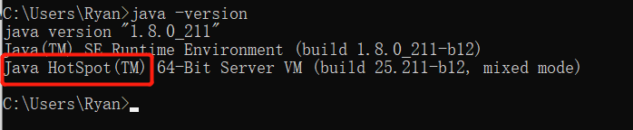
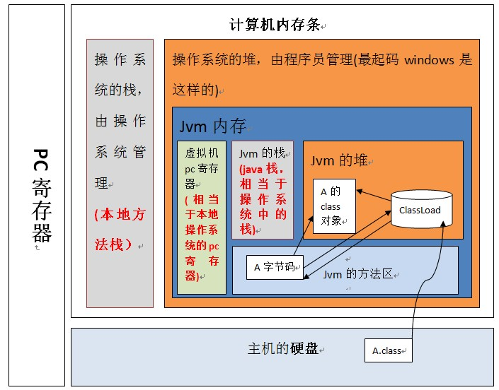
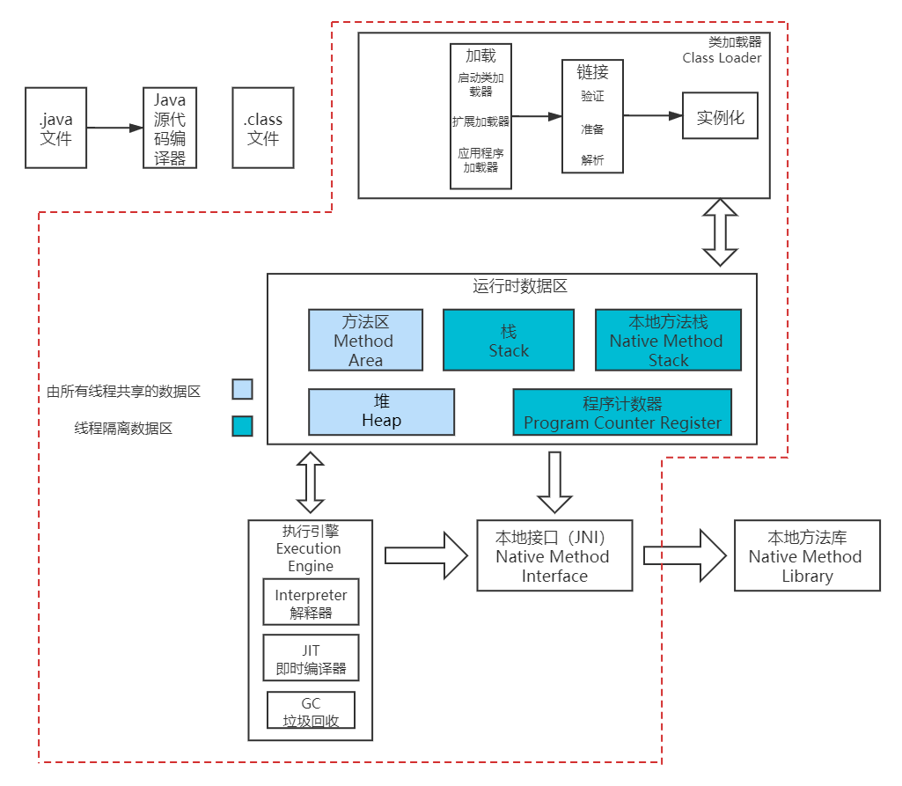
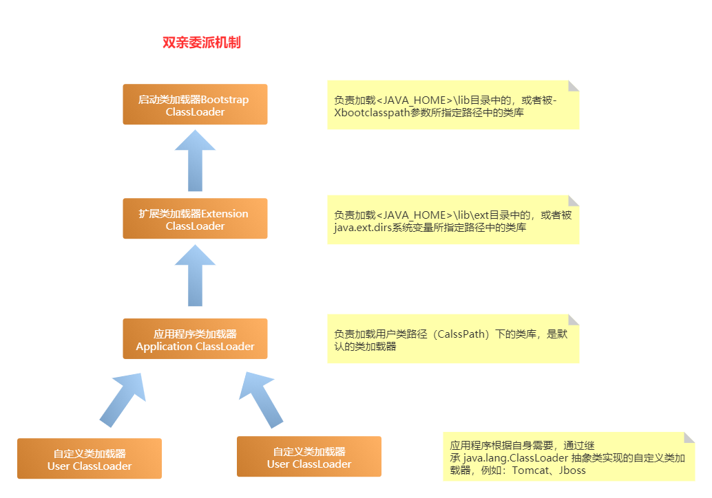
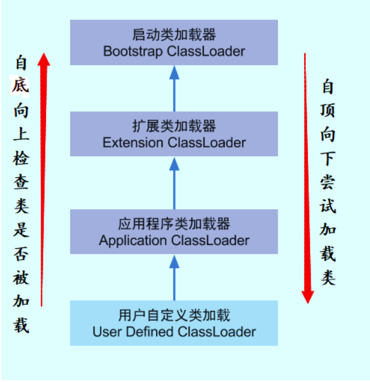
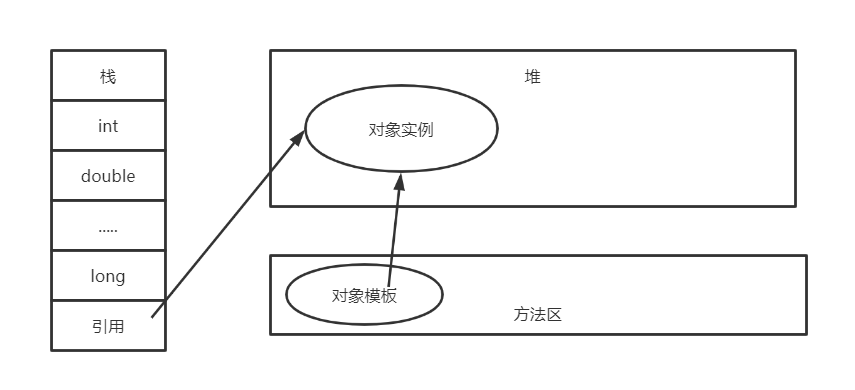
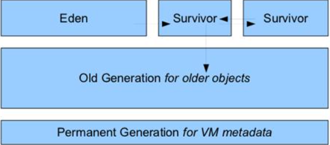
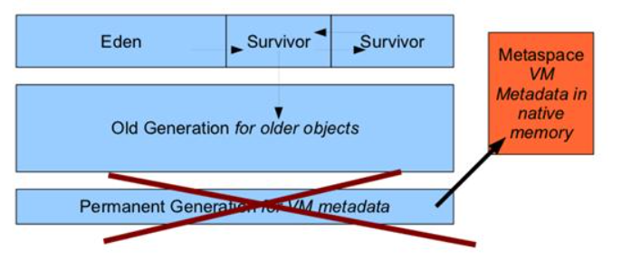
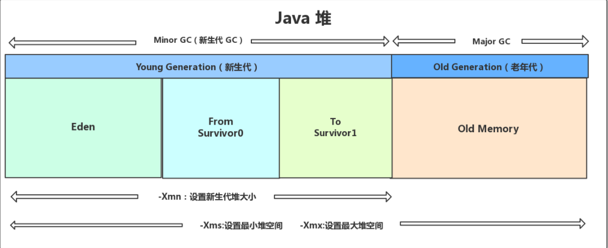
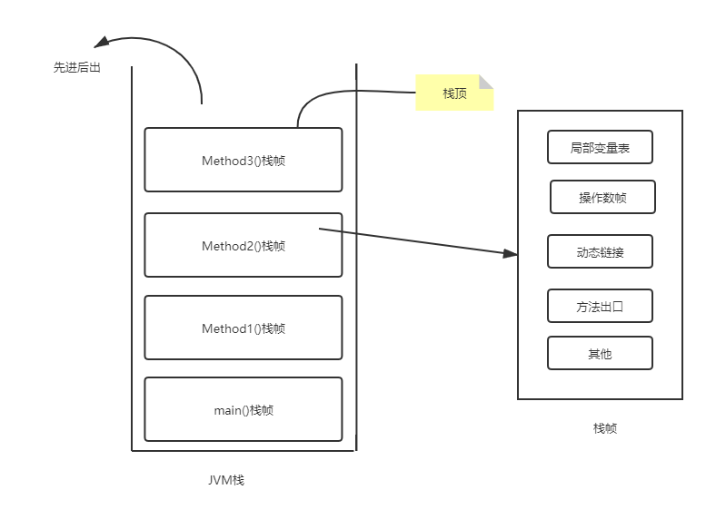

# JVM、JDK、JRE关系


- **JDK：** Java开发包，包含开发Java程序所必须的编译、运行等开发工具以及JRE (JRE包含JVM)
- **JRE：** Java运行环境，提供Java程序运行所需要的软件环境，包含JVM和丰富的系统类库(类库即Java提前封装好的功能类,可以直接拿来用) 。如果只是运行Java程序，只需安装JRE即可。
- **JVM：** Java虚拟机，执行`.class`字节码文件


## Java程序运行过程

1. 使用编辑器或IDE编写Java源代码，即`.java`文件
2. 通过`javac`（Java编译器）编译`.java`文件为`.class`字节码文件
3. 字节码文件可以在任何平台由JVM运行
4. JVM将字节码文件翻译为机器可以理解的二进制机器码

```
Java文件=> 编译器 => JVM 可执行的 Java 字节码(即虚拟指令)
=> JVM => JVM 中解释器 => 机器可执行的二进制机器码 => 程序运行
```


# 什么是JVM

1. **规范：**JVM就是一种规范，提供可执行`.class`字节码文件的运行环境。不同的供应商提供不同的实现，最受欢迎的实现是`Hotspot`。



2. **风格：**JVM有两种不同的风格-client和server。虽然Server和Client VMs相似，但是Server VM经过了特殊的调优，可以最大限度地提高峰值运行速度。它用于执行长时间运行的服务器应用程序，这些应用程序需要尽可能快的运行速度，而不是快速启动时间或更小的运行时内存占用。开发人员可以通过指定-client或-server来选择他们想要的系统。
3. **JVM生成周期：**main方法执行JVM同时启动（周期起点）-》JVM实例所有非守护线程结束（JVM结束）
4. **JVM线程**：只要有一个非守护线程没结束，JVM就无法退出
   - 守护线程：只有一个GC线程是守护线程
   - 非守护线程（普通线程）：main方法就是一个非守护线程，main方法中启动的匿名线程也是非守护线程
5. **JVM和系统：**JVM之所以称为虚拟机，是因为它提供了一个不依赖于底层操作系统和机器硬件体系结构的机器接口。JVM内存分布在操作系统的堆中。




# JVM 结构




## 类加载器Class Load

类加载器就是用来加载`.class`文件的子系统， 其主要功能有三个：`loading`(加载），`linking`（链接）,`initialization`（初始化）。 


### Loading

加载类，JVM有三种类加载方式：**BootstrapClassLoader(启动类加载器)**,**ExtensionClassLoader(扩展类加载器)** ,**AppClassLoader(应用程序类加载器)**



```java
Test test1 = new Test();
Class<? extends Test> testClass = test1.getClass();   //获取对象的类

ClassLoader classLoader = testClass.getClassLoader(); //获取类加载器

System.out.println(classLoader);             //AppClassLoader 
System.out.println(classLoader.getParent()); //ExtClassLoader 
System.out.println(classLoader.getParent().getParent()); //null C\C++编写无法获取
```


#### 双亲委派机制

**介绍**

 每个类都有一个对应的类加载器，在类加载的过程中，存在着双亲委派机制。即在类加载的时候，系统会先判断当前类是否加载过（存在缓存），有直接返回，没有就尝试加载。

1. 首先将请求委派给父类加载器`loadClass`方法处理，父类也会先**检查是否被加载过**，一直向上委托，直到启动类加载器
2. 启动类加载器**检查是否加载过**，有的话直接加载结束，没有才由下面的加载器加载 ，一直都最底层，如果都无法加载就会抛出`ClassNotFoundException`



java.lang包下的`ClassLoader`类，`loadClass`方法如下：

```java
public Class<?> loadClass(String name) throws ClassNotFoundException {
        return loadClass(name, false);
    }
    //              -----??-----
    protected Class<?> loadClass(String name, boolean resolve)
        throws ClassNotFoundException
    {
            // 首先，检查是否已经被类加载器加载过
            Class<?> c = findLoadedClass(name);
            if (c == null) {
                try {
                    // 存在父加载器，递归的交由父加载器
                    if (parent != null) {
                        c = parent.loadClass(name, false);
                    } else {
                        // 直到最上面的Bootstrap类加载器
                        c = findBootstrapClassOrNull(name);
                    }
                } catch (ClassNotFoundException e) {
                    // ClassNotFoundException thrown if class not found
                    // from the non-null parent class loader
                }
 
                if (c == null) {
                    // If still not found, then invoke findClass in order
                    // to find the class.
                    //自己尝试加载
                    c = findClass(name);
                }
            }
            return c;
    }
```


**作用**

保护了Java基础类无法被恶意修改，防止危险代码植入，避免类重复加载（JVM区分不同类的方式不仅仅根据类名，相同的类名文件被不同的类加载器加载产生的类也是不同的）。

比如：当替换`String`类（java.lang包中），由于Bootstrap ClassLoader（启动类加载器）已经加载过了，就会直接执行java.lang包中的`String`类，而这个类并无`main()`方法，所有报错

```java
package java.lang;   // 自定义的包

public class String {
    public static void main(String[] args) {
        System.out.println("这是自定义的java.lang.String类");
    }
}
```

```java
错误: 在类 java.lang.String 中找不到 main 方法, 请将 main 方法定义为:
   public static void main(String[] args)
否则 JavaFX 应用程序类必须扩展javafx.application.Application
```


### Linking

类加载完成后，执行Linking（链接），一个**字节码验证器**将验证生成的字节码是否正确，如果验证失败，得到一个验证错误。此时，还将内存分配给类中的静态变量和静态方法。


### Initialization

这是类加载的，最后一个阶段，所有的静态变量都被赋以原始初值，并执行静态代码块。


## 运行时数据区（Run-Time Data Area）

### Java对象实例化过程



### 堆（Heap）

1. 所有线程共享
2.  存储程序运行时被创建的所有对象实例（new 出来的对象）、数组
3.  JVM中管理内存最大的一个区域
4. 可以通过-Xms和-Xmx控制堆的内存大小
5. 如果堆中没有内存存储新的对象实例堆也无法扩展，就会抛出`OutOfMemoryErroy`异常
6. GC垃圾回收主要作用区（清理垃圾对象），一般做JVM调优也是在此区

#### 堆的内存分布

JDK1.7及其之前版本，堆内存分布：

* 年轻代（Eden区、FromSpace（s0）、ToSpace（s1））
* 老年代
* 永久代（方法区 非堆）




JDK1.8之后永久代（方法区 非堆）被**元空间**取代，元空间并不在JVM中而是使用**直接内存**




#### **垃圾回收机制**

垃圾回收主要作用于JVM的堆中，因此堆也被称为GC堆。



年轻代由Eden区和两个幸存区组成（按区域顺序分为from to）。Eden区占大容量，Survivor两个区占小容量，默认比例是8:1:1。大部分情况下，对象会首先在Eden区分配，在一次新生代垃圾回收后，如果对象还存在，则会进入s0或者s1，并且对象的年龄会加1，当年龄增加到一定程度（默认15），就会到老年代。这个阈值可以通过==-XX:MaxTenuringThreshold==设置


### 栈（Stack）

1. 线程私有，生命周期与线程相同，每个线程一个

2. 每个线程创建的同时就会创建一个JVM栈，JVM栈存放当前线程中的局部变量（Java8大基本数类型,非基本类型的对象只在栈存方指向堆的地址值）、部分返回结果、对象的引用

   

3. JVM最小单位可以理解为一个栈帧，一个栈帧对应一个方法，main()方法是第一个启动的在最底下；当Method1()被调用就会被压栈，Method1()又调用Method2()，Method2()也会被压栈；依次执行完毕，从栈顶开始出栈。

​       **注意：**

JVM规定了栈的最大深度，当方法调用栈太深，会抛出`StackOverflowError`错误

```java
public class MyTest {
    public static void main(String[] args) {
        MyTest myTest = new MyTest();
        myTest.a();
    }

    public void a(){
        b();
    }

    public void b(){
        a();
    }
}
```

代码中出现了循环调用


### 方法区（Method Area）

1. 所有线程共享
2. 存储static（静态变量）、final（常量）、类模板信息（不是对象实例）、常量池


### 程序计数器（PC Register）

 每个线程都有一个程序计数器，是线程私有的，就是一个指针，指向方法区中的方法字节码，存储当前正在执行的语句的物理内存地址 。占用的内存空间非常小，几乎忽略不计。

**注意：程序计数器是唯一一个不会出现 `OutOfMemoryError` 的内存区域，它的生命周期随着线程的创建而创建，随着线程的结束而死亡。**


### 本地方法栈（Native Method Stack）

1. 线程私有，生命周期与线程相同，每个线程一个。
2. 作用和JVM栈类似，区别是JVM栈执行的是Java方法，本地方法栈是执行`native`修饰的本地方法的，这是为了扩展一些Java无法实现的方法功能。


#### Native关键字 本地方法

* 凡是被`native`关键字修饰的方法，说明Java无法实现，就会调用底层C\C++语言库，属于本地方法
* 执行的时候会进入本地方法栈
* 调用本地方法接口  JNI
* 本地方法库实现本地方法接口


## 执行引擎（Execution Engine）

所有分配给JVM的代码都是由执行引擎（Execution Engine） 执行，执行引擎读取字节码文件逐行执行。使用内置的解释器和即时编译器（JIT）将字节码转换为机器码并执行。

* **解释器（Interpreter）：**
* **即时编译器（JIT Compiler）：**


## 本地方法接口（Native Method Interface）

`native`调用的接口，扩展不同语言供Java使用


## 本地方法库（Navtive Method Library）

本地方法接口的具体实现


## 沙箱机制

* **字节码校验器：**确保Java类文件遵循Java语言规范，帮助Java实现内存保护；不是所有类都会经过字节码检验，比如核心类
* **类加载器：**
  * 防止恶意代码干涉
  * 守护被信任的类库边界
  * 将代码归入保护域，确定了代码可以进行哪些操作


# 面试点

## 如何排查JVM问题

**对于正在运行的系统：**

1. 可以使用jmap来查看JVM各个区域的使用情况
2. 可以通过jstack来查看线程的运行情况，比如哪些线程阻塞了是否出现死锁
3. 可以通过jstat命令来查看垃圾回收情况，特别注意fullgc，如果fullgc比较频繁那么就要进行调优了（一般younggc就会清理掉对象，不会频繁使用fullgc）
   * 如果频繁使用fullgc但是没有出现内存溢出，那么表示fullgc回收了大部分对象，最好让这些对象能在younggc就能被回收，避免这些对象进入老年代。出现这种情况，就要排查这些存活时间不长的对象是否很大导致年轻代无法存放才直接进入老年代，可以加大年轻代的大小。
   * 找到占用内存最多的线程，定位到具体方法，优化方法，避免一些对象的创建从而减少内存占用

**对于已经出现OOM错误的系统：**

1. 一般我们都会在系统启动时加上==-XX:+HeapDumpOnOutOfMemoryError -XX:HeapDumpPath=/usr/local/base==命令，当系统出现OOM错误时会生成dump文件
2. 使用sisualvm等工具分析dump文件，找到异常实例或异常的线程（占用CPU高），进而优化代码


## 内存溢出和内存泄漏

**内存溢出：**JVM内存有限，如果对象太多，JVM无法再分配新的内存就会出现内存溢出

**内存泄漏：**如果一个对象 无用但可达 就会造成内存泄漏。GC只会回收不可达的对象（如果一个对象存在指向它的引用则是可达的；如果没有就是不可达）

如下obj就会造成内存泄漏

```java
Object obj = new Object();

list.add( obj ); //存在指向obj的引用 所以是可达的
obj = null ;     //为null  所以是无用的
```

出了这种情况，最常见的内存泄漏的情况就是打开资源但是没有关闭。例如socket、io流等，所以要调用`close()`方法防止内存泄漏

## 当你把项目介绍完后，可以这么说

1. 项目做完时，我用jmeter进行了压力测试，结果发现响应时间太慢（或者内存利用率太高） ，然后我用jvisualvm分析了下JVM的内存情况。分析后，进一步发现项目中的小对象太多了，并且发现这些小对象都是生命周期比较短的对象。然后我猜测可能就是由于短对象太多，造成了堆中新生代容量不足，进而让很多短对象逃逸到了老年代中。这样一来，新生代和老年代中的对象都会很多，就会加速GC的回收频率，从而降低系统的性能。对此，我调大了新生代的内存大小，并且调高了新生代 逃逸到老年代的 阈值。之后再测试，发现性能平稳了许多。

   

2. 项目做完时，我用jmeter进行了压力测试，结果发现响应时间太慢。然后我用mysqldumslow工具查找到了项目中执行时间最长的那个SQL语句，因此猜测是这条SQL的性能太低，拖累了整个系统。然后我用explain查看了SQL执行计划，发现这个SQL根本没有写索引并且是大表驱动了小表，所以特别慢。之后，我给它后面的where查询字段加上了索引，并且改为了小表驱动大表。然后再次测试，响应时间就缩短了很多。

> PS：这个秀点是“SQL优化”，具体流程是：定位慢SQL->使用explain查询SQL执行计划，用于分析SQL执行慢的原因->SQL优化。上述中的“小表驱动大表”等是SQL优化时的术语。