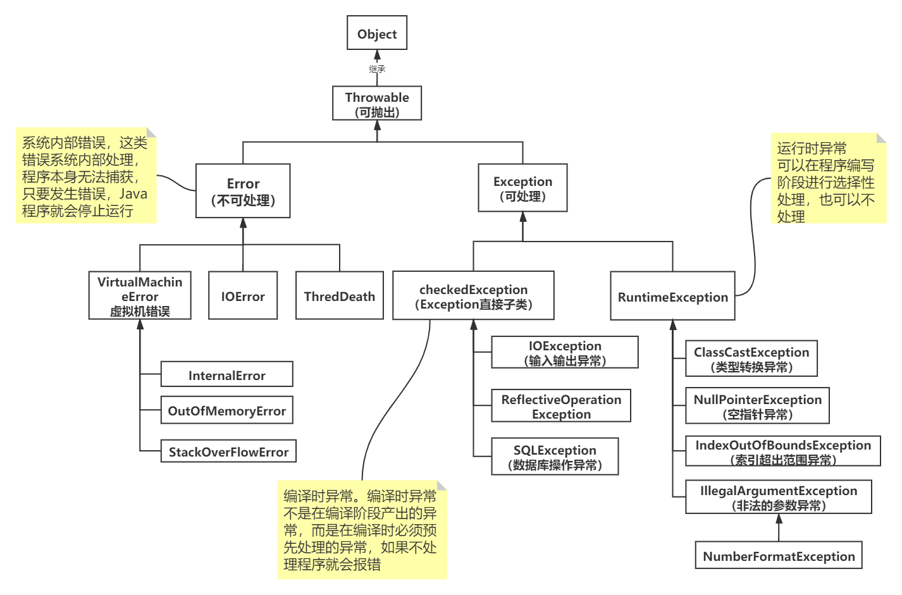
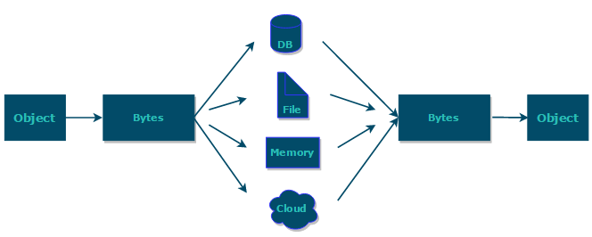
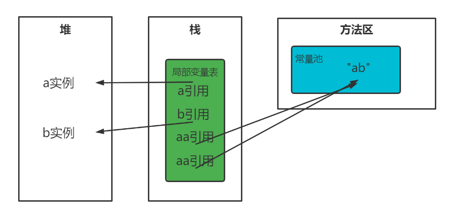

# Java 跨平台原理

 - 编译之后生成平台无关的字节码文件
 - 运行在依赖不同平台的虚拟机（JVM）上

# 配置环境

 - win平台

```powershell
JAVA_HOME = D:\Java\jdk1.7.0
PATH = %JAVA_HOME%\bin
```

 - Linux平台

```powershell
#编辑配置文件
vim /etc/profile
#在配置文件末尾加入：
export JAVA_HOME=/usr/share/jdk1.6.0_14
export PATH=$JAVA_HOME/bin:$PATH
export CLASSPATH=.:$JAVA_HOME/lib/dt.jar:$JAVA_HOME/lib/tools.jar
#使配置文件生效
source /etc/profile
```

# 基本语法

 - Java语言严格区分大小写
 - 一个Java源文件（.java）文件中可以定义多个类，但是**最多只能有一个**public类，且源文件名要与public类名相同
 - 一个源文件可包含多个Java类，成功编译后生成多个字节码文件（.class）,即每个Java类都会生成一个class文件，且字节码文件名与类名相同
 - Java程序的入口为main方法

## 字符型常量和字符串常量

1. **形式：**字符型常量是单引号引起来的一个字符；字符串常量是双引号引起来的若干个字符
2. **含义：**字符常量相当于一个整型值（ASCII值）可参与表达式运行；字符串常量相当于一个地址值（指向该字符串在内存中位置）
3. **内存大小：**字符常量占用2个字节；字符串占用若干个字节

>  字符封装类 `Character` 有一个成员常量 `Character.SIZE` 值为 16,单位是`bits`,该值除以 8(`1byte=8bits`)后就可以得到 2 个字节 

## 标识符与关键字

编写程序时的程序、类、变量等的名字就是标识符（标识符就是一个名字）；其中一些标识符被Java赋予某些标识符特殊含义，被称为关键字，用于特定的地方。

**常见关键字：**

| 访问控制             | private  | protected  | public   |              |            |           |        |
| -------------------- | -------- | ---------- | -------- | ------------ | ---------- | --------- | ------ |
| 类，方法和变量修饰符 | abstract | class      | extends  | final        | implements | interface | native |
|                      | new      | static     | strictfp | synchronized | transient  | volatile  |        |
| 程序控制             | break    | continue   | return   | do           | while      | if        | else   |
|                      | for      | instanceof | switch   | case         | default    |           |        |
| 错误处理             | try      | catch      | throw    | throws       | finally    |           |        |
| 包相关               | import   | package    |          |              |            |           |        |
| 基本类型             | boolean  | byte       | char     | double       | float      | int       | long   |
|                      | short    | null       | true     | false        |            |           |        |
| 变量引用             | super    | this       | void     |              |            |           |        |
| 保留字               | goto     | const      |          |              |            |           |        |

## final关键字

- 被final修饰的类不能被继承
- final类中的成员变量可以根据需求设计为final 成员方法则被隐式指定为final方法
- 修饰方法时 此方法不能被重写
- 修饰变量时必须初始化值 而且只能初始化一次(不能改变)

## static关键字

- 静态方法只能调用静态方法和静态变量(非静态方法可以不需创建对象 直接用类名 . 静态方法或静态变量进行调用)
- 方便在没有创建对象的情况下进行调用方法或变量
- static修饰的方法或变量不依赖对象进行访问,只要类被加载了,就可以通过类名进行访问
- static代码块可以存在于类中的任何地方可以由多个static代码块 ,在类被加载的时候static代码块按照顺序进行执行(只执行一次) 所以可以优化程序性能(很多时候我们将只需进行一次的初始化操作放到static代码块中)

# 数据类型
## 基本数据类型
Java有8中基本数据类型，如下：

 1. 整数类型：`long、int、short、byte`
 2. 浮点类型：`float、double`
 3. 字符类型：`char`
 4. 布尔类型：`boolean`

| 数据类型         | 占用字节 | 可标识范围                               | 默认值   | 对应包装类 |
| ---------------- | -------- | ---------------------------------------- | -------- | ---------- |
| byte（字节型）   | 8        | -128~127                                 | 0        | Byte       |
| short（短整型）  | 16       | -32768~32767                             | 0        | Short      |
| int（整型）      | 32       | -2147483648~2147483647                   | 0        | Integer    |
| long（长整型）   | 64       | -9223372036854775808~9223372036854775807 | 0        | Long       |
| float（单精度）  | 32       | -3.4E38~3.4E38                           | 0.0      | Float      |
| double（双精度） | 64       | -1.7E308~1.7E308                         | 0.0      | Double     |
| char（字符）     | 16       | 0~255                                    | '\u0000' | Character  |
| boolean（布尔）  | -        | true或false                              | false    | Boolean    |

### 基本数据类型与包装类型的区别

- 包装类是对象，拥有方法和字段，对象的调用都是通过引用对象的地址；基本类型不是 
- 包装类型是引用的传递；基本类型是值的传递 
- 声明方式不同： 基本数据类型不需要new关键字；
- 包装类型需要new在堆内存中进行new来分配内存空间 
- 存储位置不同： 基本数据类型直接将值保存在值栈中； 包装类型是把对象放在堆中，然后通过对象的引用来调用他们 ；基本数据类型占用空间更小。
- 初始值不同： int的初始值为 0 、 boolean的初始值为false 包装类型的初始值为null 
- 使用方式不同： 基本数据类型直接赋值使用就好； 包装类型是在集合如 coolectionMap时使用

## 自动装箱与拆箱

* 装箱：将基本类型用对应的引用数据类型包装起来（调用包装类的`valueOf()`方法）
* 拆箱：将包装数据类型转为基本数据类型（调用`xxxValue()`方法）

例子：

```java
Integer i = 10;  //装箱
int n = i;       //拆箱
```

对应字节码：

```java
 L1

    LINENUMBER 8 L1

    ALOAD 0

    BIPUSH 10

    INVOKESTATIC java/lang/Integer.valueOf (I)Ljava/lang/Integer;

    PUTFIELD AutoBoxTest.i : Ljava/lang/Integer;

   L2

    LINENUMBER 9 L2

    ALOAD 0

    ALOAD 0

    GETFIELD AutoBoxTest.i : Ljava/lang/Integer;

    INVOKEVIRTUAL java/lang/Integer.intValue ()I

    PUTFIELD AutoBoxTest.n : I

    RETURN
```

因此：

* `Integer i = 10` 等价于 `Integer i = Integer.valueOf(10)`
* `int n = i` 等价于 `int n = i.intValue()`;

## 常量池


# 方法

## 静态方法与非静态成员

静态方法属于类，在类加载时会被分配内存，通过类名直接调用

非静态成员属于实例对象，在对象实例化后，通过类的实例进行调用

在非静态成员存在时静态方法已经存在，此时调用在内存中还不存在的非静态成员属于非法操作

## 成员变量与局部变量

1. 从语法上看，成员变量属于类；局部变量是代码块或方法中定义的变量或参数；
2. 从修饰符来看，成员变量可被 `public`,`private`,`static` 等修饰符修饰；局部变量不能被访问修饰符及`static`修饰。两者都可以被`final`修饰。
3. 从存储方式看，如果成员变量被`static`修饰则是属于类的，如果没有则是属于实例的，需要实例化对象才能使用。对象存在与堆内存中，局部变量则是存在于栈内存中。
4. 从生存时间看，成员变量是对象的一部分，存在时间与对象一致；局部变量随着方法的执行而存在消失
5. 从默认值看，成员变量如果没有被赋值则会以类型的默认值自动赋值（被`final`修饰的成员变量必须被赋值）；局部变量则不会自动赋值

## 重载和重写

### 重载

在一个类中 ，方法名相同，参数类型、个数、顺序、返回值不同和访问修饰符不同；不能通过返回值的类型判断是否为重载。重载是一个类中多态的一种表现

**例子：**

```java
StringBuilder message = new StringBuilder();
//或者
StringBuilder message1 = new StringBuilder("hello world");
```

**注释：**

Java允许重载任何方法，不止是构造器。要完整描述一个方法需要指定方法名及参数列表（参数类型和顺序）。这叫做方法的**签名**（signature）。例如，String类就有4中称为indexOf()的方法，签名如下：

```java
indexOf(int)
indexOf(int,int)
indexOf(String)
indexOf(String , int)
```

其中<font color='red'>返回值类型不属于签名</font>，也就是说不能有两个名字相同，参数类型相同返回值类型不同的方法

### 重写

就是子类将父类中允许被访问的方法重新写一遍,在方法名、参数列表、返回类型 (子类函数的访问权限不能少于父类)相同的情况下对方法体进行修改或是填充

1. 返回值类型、方法名、参数列表必须相同，抛出的异常范围小于等于父类，访问修饰符范围大于等于父类。
2. 如果父类方法访问修饰符为 `private/final/static` 则子类就不能重写该方法，但是被 static 修饰的方法能够被再次声明。
3. 构造方法无法被重写

### 区别

|  区别点  |   重载   |                      重写                      |
| :------: | :------: | :--------------------------------------------: |
| 发生范围 | 同一个类 |                      子类                      |
| 参数列表 | 必须修改 |                    不能修改                    |
| 返回参数 |  可修改  |     子类的返回值类型小于等于父类返回值类型     |
|   异常   |  可修改  | 子类声明抛出的异常应小于等于父类声明抛出的异常 |
| 访问限制 |  可修改  |       子类的访问权限大于等于父类访问权限       |
| 发生阶段 |  编译期  |                     运行期                     |

# 面向对象

* **面向对象：**面向对象易于维护、复用、扩展。因为面向对象有封装、继承、多态的特性，可以设计出低耦合的系统。但是面向对象性能比面向过程低
* **面向过程：**性能比面向对象更高，因为类调用时需要实例化，开销比较大，当性能是最重要考虑因素时，面向过程更适合。

> 但这个不是根本原因，面向过程也需要分配内存，计算机偏移量，Java性能差的主要原因是因为Java是半编译语言，最终执行代码并不是能被CPU直接执行的二进制机械码
>
> 而面向过程语言大多数都可以直接编译成二进制机械码

## Object对象

Object对象是所有类的父类。

```java
public final native Class<?> getClass()//native方法，用于返回当前运行时对象的Class对象，使用了final关键字修饰，故不允许子类重写。

public native int hashCode() //native方法，用于返回对象的哈希码，主要使用在哈希表中，比如JDK中的HashMap。
public boolean equals(Object obj)//用于比较2个对象的内存地址是否相等，String类对该方法进行了重写用户比较字符串的值是否相等。

protected native Object clone() throws CloneNotSupportedException//naitive方法，用于创建并返回当前对象的一份拷贝。一般情况下，对于任何对象 x，表达式 x.clone() != x 为true，x.clone().getClass() == x.getClass() 为true。Object本身没有实现Cloneable接口，所以不重写clone方法并且进行调用的话会发生CloneNotSupportedException异常。

public String toString()//返回类的名字@实例的哈希码的16进制的字符串。建议Object所有的子类都重写这个方法。

public final native void notify()//native方法，并且不能重写。唤醒一个在此对象监视器上等待的线程(监视器相当于就是锁的概念)。如果有多个线程在等待只会任意唤醒一个。

public final native void notifyAll()//native方法，并且不能重写。跟notify一样，唯一的区别就是会唤醒在此对象监视器上等待的所有线程，而不是一个线程。

public final native void wait(long timeout) throws InterruptedException//native方法，并且不能重写。暂停线程的执行。注意：sleep方法没有释放锁，而wait方法释放了锁 。timeout是等待时间。

public final void wait(long timeout, int nanos) throws InterruptedException//多了nanos参数，这个参数表示额外时间（以毫微秒为单位，范围是 0-999999）。 所以超时的时间还需要加上nanos毫秒。

public final void wait() throws InterruptedException//跟之前的2个wait方法一样，只不过该方法一直等待，没有超时时间这个概念

protected void finalize() throws Throwable { }//实例被垃圾回收器回收的时候触发的操作
```

## 对象创建

创建对象：new创建对象实例（对象实例存于堆内存中），对象的引用指向对象（对象引用存于栈内存中）

所以对象相等是指内存中存放的内容是否相等；引用相等是指指向的内存地址是否相等

### 类构造器

类构造方法主要是完成对类对象的初始化

如果一个类没有声明构造方法，会有默认的无参构造方法，所以也可运行。如果自定义了构造方法，Java就不会添加默认构造方法。如果我们重载了有参构造方法，需写出无参构造。

**特点：**

1. 方法名必须和类名相同
2. 没有返回值，但不能用void修饰构造方法
3. 生成类的对象自动执行，无需调用
4. 构造方法不能被重写，可以被重载，所以一个类可以有多个构造方法

## 三大特性

### 封装

封装就是把一个对象的状态信息（属性）隐藏在对象内部，不允许外部对象直接访问。但是提供公开的访问方法来操作属性。如果属性不想被外部访问，就不需要提供操作方法。但是一个类没有提供外部操作属性的方法就没有意义了。就像空调挂在墙上不给你遥控器，你无法控制它，空调就是个摆设了。

一句话：给对象提供了隐藏内部特性和行为的能力

Java中有四种修饰符:`default public private protected` 每一个修饰符给对象中的属性赋予不同的访问权限

对象中也可以提供一些方法让其他对象进行操作其内部数据(get set)

封装的优点

- 通过隐藏对象的属性来保护对象的状态
- 提高代码的维护性可用性和扩张性
- 禁止对象间的不良交互提高模块化

### 继承

使用extends关键字对以存在的类作为基础建立新类，新类拥有父类的属性和方法，也可以新增属性和方法。使用继承可以快速创建新类，提高代码的复用性、耦合性。

**注意：**

- 子类拥有父类中的所有属性和方法（包括私有属性和方法），但是父类中私有属性和方法子类无法访问，只能拥有
- 被final关键字修饰的类无法被继承
- 子类继承父类中的方法，并可以对其进行扩展(对于父类中没有方法体的方法 子类需对其进行重写)
- 子类可以拥有自己独有的属性和方法
- Java中的继承是单继承 也可以是多层继承（单继承就是一个子类只能继承一个父类 多继承就是a类继承b类,b类继承c类）

### 多态

表示一个对象具有多种表现形式，具体表现为父类的引用指向子类实例。

**注意：**

* 对象类型之间具有继承、实现的关系
* 引用类型变量发出的方法属于哪个类必须在运行期间才能确定
* 多态不能调用只在子类中存在而在父类中不存在的方法
* 如果子类重写了父类的方法，正在执行的是子类的方法，反之执行的就是父类中的方法

## 抽象类

- 抽象类不能进行行实例化，即不能用new关键字来创建对象
- 类中如果有一个方法是抽象方法(没有方法体) 则此类为抽象类，必须使用abstract修饰，但是抽象类中的方法不一定都是抽象的(接口除外) 这些抽象方法在子类中必须进行重写
- 抽象类就是用来定义规范的，其他类参考这个类中定义的方法进行逻辑代码的实现

## 接口

- 接口是由全局变量和抽象方法(因为是抽象方法所以不能有方法体)所构成的抽象类
- 其实现类必须实现其定义的所以方法(重写 按照功能不能补充不同的方法体)
- 接口可以多实现
- 接口中的变量一定是 **public static final** 的
- 接口中的方法都是 **public abstract** 不能是staic的(static方法必须实现即必须有方法体，而抽象方法不能在本类中进行实现)

# 反射

# 异常



## Exception和Error

所有异常类都是Throwable的子类。Exception（异常）和Error（错误）是Throwable最重要的两个子类。Exception可以被程序处理（try-catch），Error是无法处理的。

* **`Exception`** :程序本身可以处理的异常，可以通过 `catch` 来进行捕获。`Exception` 又可以分为 受检查异常(必须处理) 和 不受检查异常(可以不处理)。
* **`Error`** ：`Error` 属于程序无法处理的错误 ，我们没办法通过 `catch` 来进行捕获 。例如，Java 虚拟机运行错误（`Virtual MachineError`）、虚拟机内存不够错误(`OutOfMemoryError`)、类定义错误（`NoClassDefFoundError`）等 。这些异常发生时，Java 虚拟机（JVM）一般会选择线程终止。

## 受检查异常

 除了`RuntimeException`及其子类以外，其他的`Exception`类及其子类都属于受检查异常 。此类异常也叫编译时异常，必须 被 `catch`/`throw` 处理 ，否则无法通过编译

## 不受检查异常

 `RuntimeException` 及其子类都统称为非受检查异常 ，也叫运行时异常

## Throwable类常用方法

- **`public string getMessage()`**:返回异常发生时的简要描述
- **`public string toString()`**:返回异常发生时的详细信息
- **`public string getLocalizedMessage()`**:返回异常对象的本地化信息。使用 `Throwable` 的子类覆盖这个方法，可以生成本地化信息。如果子类没有覆盖该方法，则该方法返回的信息与 `getMessage（）`返回的结果相同
- **`public void printStackTrace()`**:在控制台上打印 `Throwable` 对象封装的异常信息

## 异常处理

### try-catch-finally

* **try块：**用于捕获异常。可以接一个或多个catch块，如果没有catch块则必须跟一个finally块
* **catch块：**用于处理try捕获的异常
* **finally块：**无论是否捕获或处理异常（只要执行了try块中代码），finally块中的代码都会执行；如果try块和catch块中遇到return语句，finally会在方法返回之前被执行

**注意：以下3中情况finally不会被执行**

1. 在try或catch块中使用System.exit(int i)时
2. 程序所在的线程死亡
3. 关闭CPU

# I/O

## 序列化

### 介绍

* **使用场景：**当我们需要持久化 Java对象时，比如将对象保存到文件、网络传输，这些场景就会用到序列化

* **意义：** 序列化机制允许将实现序列化的Java对象转换位字节序列，这些字节序列可以保存在磁盘上，或通过网络传输，以达到以后恢复成原来的对象。序列化机制使得对象可以脱离程序的运行而独立存在。 

* **序列化：**将数据结构或对象转为二进制字节流的过程（ 将对象写入到IO流中 ）
* **反序列化：**将序列化过程中产生的二进制字节流转为数据接口或对象的过程（ 从IO流中恢复对象 ）



### 实现序列化方式

 如果需要将某个对象保存到磁盘上或者通过网络传输，那么这个类应该实现`Serializable`接口或者`Externalizable`接口之一 


## I/O的类

JavaI/O流主要是从如下4中类派生出来的

* InputStream、Reader：所有输入流的基类，前者是字节流后者是字符流
* OutputStream、Writer：所有输出流的基类，前者是字节流后者是字符流

# 设计模式

- 创建型模式（五种）：工厂方法模式、抽象工厂模式、单例模式、建造者模式、原型模式
- 结构型模式（七种）：适配器模式、装饰器模式、代理模式、外观模式、桥接模式、组合模式、享元模式
- 行为型模式（十一种）：策策略模式、模板方法模式、观察者模式、迭代子模式、责任链模式、命令模式、备忘录模式、状态模式、访问者模式、中介者模式、解释器模式。


# Java8新特性

## lambda表达式

lambda编程是建立在函数式接口得基础上的

1. 只包含一个抽象方法的接口，称为函数式接口。
2. 可以通过 Lambda 表达式来创建该接口的对象。
3. 可以在任意函数式接口上使用 ==@FunctionalInterface== 注解，这样做可以检测它是否是一个函数式接口，同时 javadoc 也会包含一条声明，说明这个接口是一个函数式接口。

在实际开发者两个比较常见的函数式接口：**Runnable接口，Comparator接口**

**函数式接口的实例可以通过 lambda 表达式、 方法引用、构造方法引用来创建**

```java
public class TestArray {
    
    public static void main(String[] args) {
        String[] players = {"zhansgan", "lisi", "wangwu", "zhaoliu",  "wangmazi"};  

        // 1.1 使用匿名内部类根据 surname 排序 players  
        Arrays.sort(players, new Comparator<String>() {  
            @Override  
            public int compare(String s1, String s2) {  
                return (s1.compareTo(s2));  
            }  
        });  
        
        // 1.2 使用 lambda 排序,根据 surname  
        Arrays.sort(players, (String s1, String s2) ->  s1.compareTo(s2));  
         
//================================================================================================
          
        // 2.1 使用匿名内部类根据 name lenght 排序 players  
        Arrays.sort(players, new Comparator<String>() {  
            @Override  
            public int compare(String s1, String s2) {  
                return (s1.length() - s2.length());  
            }  
        });  

        // 2.2使用Lambda,根据name length  
        Arrays.sort(players, (String s1, String s2) -> (s1.length() - s2.length()));  
    
//==================================================================================================    
        
        // 3.1 使用匿名内部类排序 players, 根据最后一个字母  
        Arrays.sort(players, new Comparator<String>() {  
            @Override  
            public int compare(String s1, String s2) {  
                return (s1.charAt(s1.length() - 1) - s2.charAt(s2.length() - 1));  
            }  
        });  

        // 3.2 使用Lambda,根据最后一个字母
        Arrays.sort(players, (String s1, String s2) -> (s1.charAt(s1.length() - 1) - s2.charAt(s2.length() - 1)));  
    }
}session和cookie
```

###  

## 接口的默认方法和静态方法


## Streams


## Optional


## Date/Time API(JSR 310)


# 面试点


## String、StringBuffer和StringBuilder

1. **可变性**

String类中使用final关键字修饰数组来保存字符串，`private final char value[];`，所有String是不可变的

StringBuffer和StringBuilder都是继承自`AbstractStringBuilder`类，该类中使用`char[] value;`来保存字符串，所有这两种对象是可变的

>  在 Java 9 之后，String 、`StringBuilder` 与 `StringBuffer` 的实现改用 byte 数组存储字符串 `private final byte[] value` 

2. **线程安全性**

String是不可变的，可以理解为常量，所有是线程安全的。

`AbstractStringBuilder`中定义了一些字符串的基本操作方法，如 `expandCapacity`、`append`、`insert`、`indexOf` 等公共方法 。StringBuffer对这些方法加了同步锁`synchronized`所有是线程安全的，而StringBuilder没有所有是线程不安全的

3. **性能**

每次对String进行改变的时候都会创建一个新的String对象（因为是不可变的），然后指针指向新的对象，所有新能较低。

 StringBuffer 和StringBuilder都是对其本身进行操作，而不产生新的对象。相同情况下StringBuilder比StringBuffer提升10%~15%的性能。

4. **总结**
   1. 操作少量数据时使用String
   2. 单线程操作大量数据使用StringBuilder
   3. 多线程操作大量数据使用StringBuffer


## ==和equals的区别

对于基本数据类型来说，==比较的是值==；对于引用数据类型来说，==比较的是对象的内存地址==

> Java只有值传递，对于==来说不管是基本数据类型还是引用数据类型，本质都是比较值，引用数据类型变量的值就是对象的内存地址

``equals()``不能用于判断基本数据类型的变量，只能用于判断两个对象是否相等。``equals()``方法存于``Object``中，实现如下：

```java
public boolean equals(Object obj) {
     return (this == obj);
}
```

使用场景：

* 类没有覆盖了``equals()``方法：等价于 == ，默认使用的是``Object``中的``equals()``方法
* 类覆盖了``equals()``方法：使用该类中重写的``equals()``方法进行比较，如果属性值相等则返回true（这两个对象相等）

```java
public static void main(String[] args) {

        String a = new String("ab"); //a 为一个引用
        String b = new String("ab"); //b为另一个引用,对象的内容一样
        String aa = "ab";            // 放在常量池中
        String bb = "ab";            // 从常量池中查找

        System.out.println(aa == bb);       //true
        System.out.println(aa.equals(bb));  //true
        System.out.println(a == b);         //false
        System.out.println(a.equals(b));    //true
        System.out.println(a == aa);        //false
        System.out.println(a.equals(aa));   //true
    }
```

**说明：**

* String重写了``equals()``方法，所有比较的是对象的值
* Java为了避免产生大量String对象，设计了常量池，创建字符串时会先在常量池中查询是否存在值相等的字符串，如果有则不创建，没有则在常量池创建新的字符串常量
* new String("ab") 时，虚拟机会在常量池中查找是否存在与ab字符串（与创建对象值相同的值），如果有则赋给当前引用，如果没有则在常量池中创建新字符串常量；new Stirng时还会在堆内存中创建新的String对象，存储ab。所以new 一个String 对象，会先在常量池查找再在堆中创建String 对象，String a = new String("ab")会创建一个或两个对象



## continue、break、return

在循环体中，当不满足循环条件或者达到循环次数时，循环体就会正常结束；但是我们需要在循环体中满足某种条件而提前结束循环，就会使用到这些关键字

1. continue：跳出当此循环，执行下次循环
2. break：跳出整体循环，结束循环执行后续代码
3. return：直接返回结果，结束方法运行，使用方法如下：
   * `return;`：直接结束方法运行且无返回值
   * `return value;`：结束方法并返回结果

## 如何查看线程死锁

1. 可以通过jstack命令进行查看，会显示发生死锁的线程
2. 两个线程操作数据库时，数据库可能发生死锁，这时就要查询数据库的死锁情况

## 说一下ThreadLocal

1. ThreadLocal是Java中提供的线程本地存储机制，可以利用该机制将数据缓存在线程内部，保证数据的属于当前线程

2. ThreadLocal底层是通过ThreadLocalMap实现，每一个Thread对象（注意不是ThreadLocal对象）都存放一个ThreadLocalMap对象，Map的key就是ThreadLocal对象，value就是要缓存的值

3. 如果在线程池中使用ThreadLocal会造成内存溢出。因为线程池中的线程没有停止，那么就会一直有强引用指向ThreadLocal对象，而ThreadLocal对象有包含了key、value的Entry对象，这个对象也无法被GC回收，随着线程长时间执行，这个对象就会越来越多最终造成内存溢出

   **解决方法：**在线程执行完毕后通过ThreadLocal中的`remove`方法手动清理其中的Entry对象

```java
public class User {

    private ThreadLocal<String> name = new ThreadLocal<>();


    public String getName() {
        return this.name.get();
    }

    public void setName(String name) {
        this.name.set(name);
    }
    
    public void remove(){
        this.name.remove();         //ThreadLocal中的remove方法 清理Entry对象
    }

    /*private String name;

    public String getName() {
        return name;
    }

    public void setName(String name) {
        this.name = name;
    }*/
}
----------------------------------------------------------------------------------------

public static void main(String[] args) {
        User user = new User();

        new Thread(new Runnable() {
            @Override
            public void run() {
                user.setName("hello");

                try{
                    TimeUnit.SECONDS.sleep(3);
                    System.out.println(Thread.currentThread()+"----"+user.getName());
                    
                    user.remove();    //调用 remove方法
                }catch (InterruptedException e){
                    e.printStackTrace();
                }
            }
        }).start();

        new Thread(new Runnable() {
            @Override
            public void run() {
                user.setName("world");

                try{
                    TimeUnit.SECONDS.sleep(3);
                    System.out.println(Thread.currentThread()+"----"+user.getName());
                    
                    user.remove();
                }catch (InterruptedException e){
                    e.printStackTrace();
                }
            }
        }).start();
    }
-----------------------------------------------------------------------------------------
每个线程使用的都是缓存在该线程中的name
Thread[Thread-1,5,main]----world
Thread[Thread-0,5,main]----hello

```

```java
  //ThreadLocal中的remove方法实现
    public void remove() {
         ThreadLocalMap m = getMap(Thread.currentThread());
         if (m != null)
             m.remove(this);
     }
```

```java
//ThreadLocal中的set方法实现   ThreadLocalMap存储 key 为ThreadLocal对象 value为缓存的值
   public void set(T value) {
        Thread t = Thread.currentThread();
        ThreadLocalMap map = getMap(t);
        if (map != null)
            map.set(this, value);
        else
            createMap(t, value);
    }
```

```java
//ThreadLocal中的get方法实现   通过ThreadLocal对象作为key 查询value
   public T get() {
        Thread t = Thread.currentThread();
        ThreadLocalMap map = getMap(t);
        if (map != null) {
            ThreadLocalMap.Entry e = map.getEntry(this);
            if (e != null) {
                @SuppressWarnings("unchecked")
                T result = (T)e.value;
                return result;
            }
        }
        return setInitialValue();
    }
```

## 为啥有了字符流还要字节流

不管是文件读写还是网络发送接收，信息的最小单位都是字节。

字符流是JVM将字节流转换得来的，但是这个过程非常耗时，当不知道编码类型的时候容易出现乱码的问题。I/O中提供的字符流操作接口方便我们对字符的操作。对于音频、图片、媒体文件用字节流比较好，对于字符文件用字符流比较好

