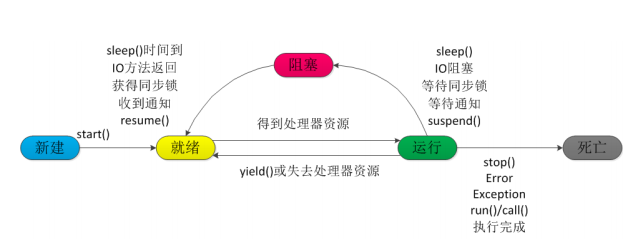

# 线程实现

## Thread

## Runnable

## Callable


## 线程池

### **线程池的优势**

降低资源消耗 通过重复利用已创建的线程降低线程创建消耗的资源

提高响应速度 当任务到达时不需等待线程就可以立即执行

提高线程的可管理性 使用线程池统一分配管理和优化


# 线程的状态（生命周期）

**新建**

**就绪**

**运行**

**阻塞**

**死亡**




# sleep 和wait区别

1. sleep方法是属于Thread的，wait方法是属于Object的
2. sleep会导致程序暂停指定时间，让出cpu其他线程，到达指定时间后会继续执行
3. sleep不会释放对象锁，wait会释放对象锁
4. `wait()` 通常被用于线程间交互/通信，`sleep() `通常被用于暂停执行
5. `wait()` 方法被调用后，线程不会自动苏醒，需要别的线程调用同一个对象上的 `notify() `或者 `notifyAll()` 方法。`sleep() `方法执行完成后，线程会自动苏醒。或者可以使用 `wait(long timeout)` 超时后线程会自动苏醒


# start 与 run 区别

1. start方法用来启动线程，线程会进入就绪状态，并没有真正运行
2. run方法执行线程的内容，线程进入运行状态，开始执行run方法中的代码

**总结： 调用 `start()` 方法方可启动线程并使线程进入就绪状态，直接执行 `run()` 方法的话不会以多线程的方式执行。**


# Java锁

## synchronized

synchronized  锁的对象是方法的调用者（对象实例） 当调用者为同一个对象时 谁先调用 谁先执行

如果调用的是普通方法 那么先执行普通方法

如果是两个不同对象 优先执行快的方法（无延迟）

如果static修饰方法时 锁的是类模板（Class）


## Lock


# 多线程集合


# 常用辅助类

## CountDownLatch

减法计数器

```java
countDownLatch.countDown();   // -1
countDownLatch.await();       //等待计数器归零  直接后续代码
```


## CyclicBarrier

加法计数器 


## Semaphore

