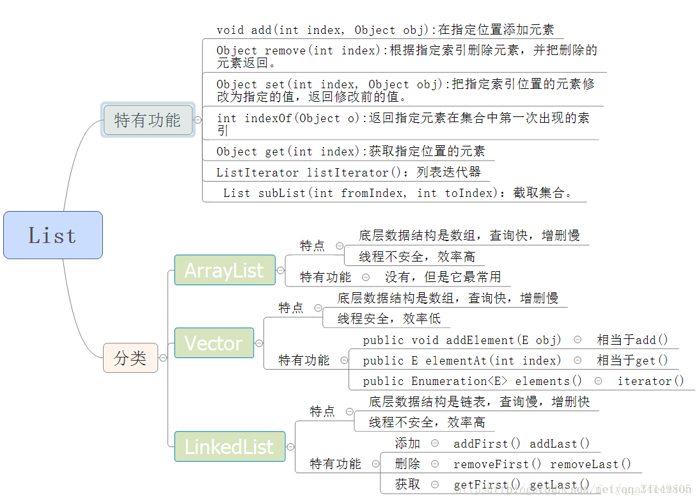

集合介绍


# 集合和数组的区别


# 集合的使用选择


# list(接口)

- **ArrayList**: 底层为数组实现 增删数据慢(每次都会判断数据量是否超过数组的size) 查询数据快(直接通过下标进行查询数据) 线程不安全效率高 可以存储重复的数据

- **LinkedList**: 底层为链表实现 增删数据快(直接在链表的最后进行添加) 查询数据慢(得遍历所有数据进行查询) 线程不安全 效率高 可以存储重复数据

- **Vector**:底层数据结构是数组，查询快，增删慢，线程安全，效率低，可以存储重复元素

- **使用场景**:

  - 当需要对数据进行访问查询的时候用ArrayList 当需要对数据进行增删修改的时候用LinkedList
  - Vector是线程同步的 线程安全 而ArrayList线程不安全 在不考虑线程安全的情况下用ArrayList效率高

  

## ArrayList和LinkedList的区别

1. 数据结构不同，ArrayList底层是基于数组实现的，LinkedList底层是基于链表实现的
2. 由于数据结构不同ArrayList的查询操作效率更高，LinkedList的增删效率更高
   * ArrayList查询时通过下标（数组）可以快速定位到数据；而LinkedList则需要遍历链表。但是LinkedList中提供了`getFirst()`和`getLast()`方法（实现了Deque接口，双端队列），所以LinkedList获取第一个和最后一个数据又很快
   * LinkedList新增数据（调用`add()`方法）直接在链表末尾添加该数据
3. LinkedList实现了

## ArrayList扩容机制

* ArrayList每次新增数据（调用`add()`方法）都会调用`ensureCapacityInternal()`方法保证集合的容量
* ArrayList默认容量是10，如果初始化时指定了容量或者通过集合作为作为参数创建ArrayList对象，则容量为指定大小或者集合参数的大小，每次扩容为1.5倍，如果扩容后小于新增数据后的集合容量，则扩容到新增后所需的最小容量。


## ArrayList自定义排序

实现Comparable类，重写其中的compareTo方法，再使用 Collections.sort() 来排序对象数组


# set(接口)

- **HashSet**: 底层为哈希表实现 数据无序且唯一 线程不安全 效率高 可以存储null数据(只能存储一个null数据)
- **TreeSet** :底层为二叉树实现 数据唯一有序(确保数据的唯一性的方法和HashSet一样 二叉树保证数据的有序性 根据构造方法不同，分为自然排序（无参构造）和比较器排序（有参构造），自然排序要求元素必须实现 ) 能存放null数据
- **LinkedHashSet**底层数据结构采用链表和哈希表共同实现，链表保证了元素的顺序与存储顺序一致(遍历和插入数据的顺序一致)，哈希表保证了元素的唯一性。线程不安全，效率高


# map(接口)

Map用于保存具有映射关系的数据，没有继承Collection类 Map里保存着两组数据：key和value，它们都可以使任何引用类型的数据，但key不能重复。所以通过指定的key就可以取出对应的value

## 主要方法


## HashMap

### jdk1.7-jdk1.8变化

1. 1.7中底层是数组+链表实现的，1.8是数组+链表+红黑树实现的，可以提高HashMap的插入和查询的效率
2. 1.7链表插入数据是使用头插法，1.8因为插入数据的时候要判断链表的个数需要遍历链表，所以用的是尾插法
3. 1.8中对hash算法进行了优化

------

* 以key-value形式存储数据。添加数据时（调用put()方法）会先对传入的key进行hash计算（调用hash(key)方法）得到数组的下标，定位到数组元素，再判断key是否存在（调用key.equals(k)方法），如果存在会更新value，不存在就会把该key-value存入


------

* 当put的key-value中key为null时，hashCode(key)方法返回的数组下标为 0

```java
static final int hash(Object key) {
    int h;
    return (key == null) ? 0 : (h = key.hashCode()) ^ (h >>> 16);
}
```

* 当链表的长度大于8时该链表就会自动转为红黑树

```java
//hashMap put方法
for (int binCount = 0; ; ++binCount) {
    if ((e = p.next) == null) {
        p.next = newNode(hash, key, value, null);
        if (binCount >= TREEIFY_THRESHOLD - 1) // -1 for 1st    TREEIFY_THRESHOLD = 8
            treeifyBin(tab, hash);             //转为红黑树  树形化
        break;
    }
    if (e.hash == hash &&
        ((k = e.key) == key || (key != null && key.equals(k))))
        break;
    p = e;
}
```

HashMap中红黑树相关的参数

```java
//一个桶的树化阈值
//当桶中元素个数超过这个值时，需要使用红黑树节点替换链表节点
//这个值必须为 8，要不然频繁转换效率也不高
static final int TREEIFY_THRESHOLD = 8;

//一个树的链表还原阈值
//当扩容时，桶中元素个数小于这个值，就会把树形的桶元素 还原（切分）为链表结构
//这个值应该比上面那个小，至少为 6，避免频繁转换
static final int UNTREEIFY_THRESHOLD = 6;

//哈希表的最小树形化容量
//当哈希表中的容量大于这个值时，表中的桶才能进行树形化
//否则桶内元素太多时会扩容，而不是树形化
//为了避免进行扩容、树形化选择的冲突，这个值不能小于 4 * TREEIFY_THRESHOLD
static final int MIN_TREEIFY_CAPACITY = 64;
```


## HashTable

操作数据的方法上加了`synchronized`关键字，所以是线程安全的

key-value都不能为null，会直接报空指针异常

```java
public synchronized V put(K key, V value) {
        // Make sure the value is not null
        if (value == null) {
            throw new NullPointerException();   //空指针异常了
        }

        // Makes sure the key is not already in the hashtable.
        Entry<?,?> tab[] = table;
        int hash = key.hashCode();              //也会空指针异常
        int index = (hash & 0x7FFFFFFF) % tab.length;
        @SuppressWarnings("unchecked")
        Entry<K,V> entry = (Entry<K,V>)tab[index];
        for(; entry != null ; entry = entry.next) {
            if ((entry.hash == hash) && entry.key.equals(key)) {
                V old = entry.value;
                entry.value = value;
                return old;
            }
        }

        addEntry(hash, key, value, index);
        return null;
    }
```


## ConcurrentHashMap

### JDK1.7版本中的实现原理

ConcurrentHashMap中的分段锁称为Segment，它即类似于HashMap的结构，即**内部拥有一个Entry数组，数组中的每个元素又是一个链表,同时又是一个ReentrantLock（Segment继承了ReentrantLock**

**ReentrantLock+Segment+HashEntry**

第一次Hash定位到Segment，第二次Hash定位到元素所在链表的头部（数组的下标）


**优点：**写操作的时候可以只对元素所在的Segment进行加锁即可，不会影响到其他的Segment，这样，在最理想的情况下，ConcurrentHashMap可以最高同时支持Segment数量大小的写操作（刚好这些写操作都非常平均地分布在所有的Segment上）。
所以，通过这一种结构，ConcurrentHashMap的并发能力可以大大的提高。

**缺点：**这一种结构的带来的副作用是Hash的过程要比普通的HashMap要长


### JDK1.8版本中的实现原理

JDK8中ConcurrentHashMap参考了JDK8 HashMap的实现，采用了数组+链表+红黑树的实现方式来设计，内部大量采用CAS操作

**synchronized+CAS+HashEntry+红黑树**


**🌈总结：**

**数据结构：**取消了Segment分段锁的数据结构，取而代之的是数组+链表+红黑树的结构。
**保证线程安全机制：**JDK1.7采用segment的分段锁机制实现线程安全，其中segment继承自ReentrantLock。JDK1.8采用CAS+Synchronized保证线程安全。
**锁的粒度：**原来是对需要进行数据操作的Segment加锁，现调整为对每个数组元素加锁（Node）。
链表转化为红黑树:定位结点的hash算法简化会带来弊端,Hash冲突加剧,因此在链表节点数量大于8时，会将链表转化为红黑树进行存储。
**查询时间复杂度：**从原来的遍历链表O(n)，变成遍历红黑树O(logN)


## TreeMap

非线程安全基于红黑树实现


# 集合中的数据结构总结

ArrayXxx:底层数据结构是数组，查询快，增删慢 LinkedXxx:底层数据结构是链表，查询慢，增删快 HashXxx:底层数据结构是哈希表。依赖两个方法：hashCode()和equals() TreeXxx:底层数据结构是二叉树。两种方式排序：自然排序和比较器排序

##  