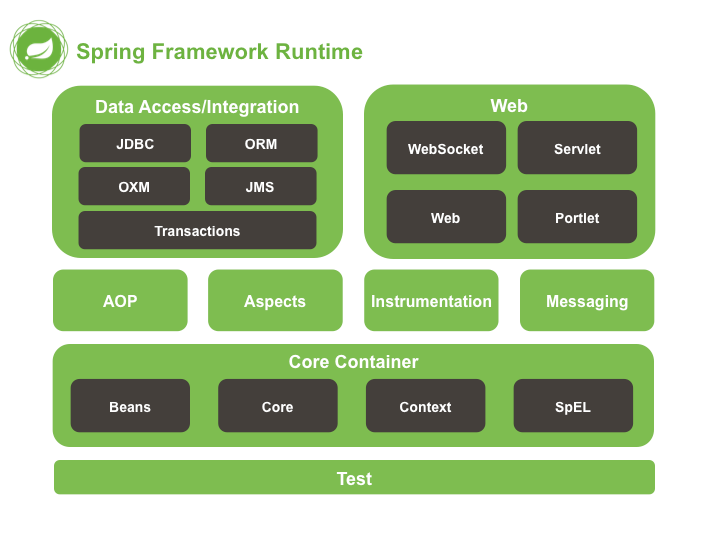
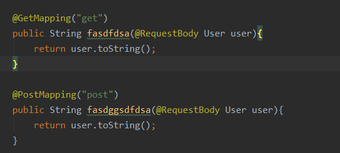
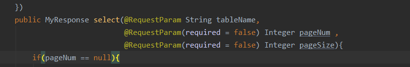

# 基本信息



**Spring框架的核心就是IoC（控制反转）和AOP（面向切面编程）**

# 特点

1. 方便解耦,简化开发(IOC)
2. 方便集成各种框架
3. 低入侵性,无需实现spring的接口就可以使用其中封装的方法
4. 面向切面编程aop

# Spring IOC

将创建对象的工作反转交给spring ioc容器 , 对代码进行解耦

传统模式下我们通过new的方法创建对象,这样的做法使代码的耦合度高,spring利用ioc容器统一去管理和创建对象,由ioc控制外部资源对该对象或文件的获取

## 容器生成方法

### BeanFactory

 ioc使用反射机制通过工厂模式读取xml文件创建一个JavaBean容器来管理对象(工厂模式解耦)这个接口为BeanFactory

读取配置文件时不会创建对象,只在用时创建( 延迟实例化 )，应用启动的时候占用资源很少适用于对资源要求较高的应用

| 方法                                                         | 说明                                                         |
| ------------------------------------------------------------ | ------------------------------------------------------------ |
| Object getBean(String name) throws BeansException;<T> T getBean(String name, Class<T> requiredType) throws BeansException;Object getBean(String name, Object... args) throws BeansException;<T> T getBean(Class<T> requiredType) throws BeansException;<T> T getBean(Class<T> requiredType, Object... args) throws BeansException; | 多个getBean的方法，可以通过Bean的name（by name），也可以通过bean的类型（by type）。 |
| boolean containsBean(String name);                           | 是否包含Bean                                                 |
| boolean isSingleton(String name) throws NoSuchBeanDefinitionException; | Bean是否是单例，这里需要注意的是，默认情况下，Bean都是以单例形式存在的，与其相反的是原型模式的Bean，当我们创建了一个原型模式下的Bean，IoC容器就会创建一个新的Bean返回给调用者，这与Bean的作用域有关。 |
| boolean isPrototype(String name) throws NoSuchBeanDefinitionException; | Bean是否是原型，也就是"多例"                                 |
| boolean isTypeMatch(String name, ResolvableType typeToMatch) throws NoSuchBeanDefinitionException;boolean isTypeMatch(String name, Class<?> typeToMatch) throws NoSuchBeanDefinitionException; | 是否类型匹配                                                 |
| Class<?> getType(String name) throws NoSuchBeanDefinitionException; | 获取Bean的类型                                               |
| String[] getAliases(String name);                            | 获取Bean的别名                                               |


#### **模仿的一个BeanFactory类**

```java
public class BeanFactory {

    //定义一个properties对象
    private static Properties props;

    //定义一个map 用来存储配置文件种的key-value 就是容器
    private static Map<String, Object> beans;

    //使用静态代码块 为props赋值
    static {
        try {
            //实例化properties对象
            props = new Properties();
            //获取配置文件的流对象  在入系统中的所有Resource文件
            InputStream is = BeanFactory.class.getClassLoader().getResourceAsStream("bean.properties");
            props.load(is);
            //实例化容器
            beans = new HashMap<String, Object>();
            //取出配置文件中的值
            Enumeration keys = props.keys();
            //遍历枚举
            while (keys.hasMoreElements()){
                String key = keys.nextElement().toString();
                //反射建立对象
                Object value = Class.forName(props.getProperty(key)).newInstance();
                //将key-value存入容器
                beans.put(key,value);
            }
        } catch (Exception e) {
            throw new ExceptionInInitializerError("初始化properties失败");
        }
    }

    //获取配置文件值
    public static Object get(String key){
        return beans.get(key);
    }

//    public static void main(String[] args) {
//        System.out.println(get("IAccountDao"));
//    }
}
```

创建bean.properties

```
IAccountDao=com.yan.dao.impl.AccountDaoImpl
IAccountService=com.yan.service.impl.AccountServiceImpl 
```

创建对象

```java
//IAccountDao iAccountDao = new IAccountDao()
IAccountDao iAccountDao = (IAccountDao)BeanFactory.get("IAccountDao");  //此对象为单例对象只被创建一次

public class AccountDaoImpl implements IAccountDao{
    int i =0 ;
    public void saveDao() {
        for (int a =0 ; a <3 ; a ++){
            System.out.println(i);
            i++;
            System.out.println("保存成功");
        }
    }
}
//
输出0
保存成功
1
保存成功
2
保存成功
单例对象中的成员变量也就初始化一次
```

- 注解

  JavaBean : 可重用组件 用来创建service和dao对象

  在配置文件中配置service和dao对象 格式(唯一标识符=权限定类名)

  ioc创建的对象默认是单例对象( 当scope设置为prototype的时为多例 **@Scope(value="prototype"**) //创建多实例* )

  ***singleton（单例）\***:共享一个实例对象,对象类中的成员变量也只会初始化一次(节约资源)

  ***prototype（多例）\*** :对这个bean的每次请求都会创建一个新的bean实例 (防止并发问题线程安全) ,当一个bean是多例模式的情况下，lazy-init为false或者default无效

  使用标准:当对象在请求中会被改变状态的话(存在类成员变量)就使用多例,反之单例

  举例: 数据库连接池就是单例模式，有且仅有一个连接池管理者，管理多个连接池对象。


### ApplicationContext 

在Spring的发展中，在BeanFactory的基础上，还设计了一个更为高级的接口，ApplicationContext，它通过继承上级接口进而继承BeanFactory，它在BeanFactory的基础上，扩展了消息国际化接口(MessageSource)、环境可配置接口(EnvironmentCapable)、应用事件接口(ApplicationEventPublisher)和资源模式解析接口(ResourcePatternResolver)。那么，BeanFactory有的方法ApplicationContext自然也会有，后面的示例就直接用ApplicationContext进行。

ApplicationContext接口有以下3个常用实现类，可以实例化任何一个类来创建Spring的ApplicationContext容器。

读取配置文件生成容器的时候就会创建对象( 不延迟实例化 )

- 所有的Bean在启动的时候都加载，系统运行的速度快；
- 在启动的时候所有的Bean都加载了，我们就能在系统启动的时候，尽早的发现系统中的配置问题
- 建立web应用，在启动的时候就把所有的Bean都加载了。（把费时的操作放到系统启动中完成)

| ApplicationContext实现类           | 说明                                                         |
| ---------------------------------- | ------------------------------------------------------------ |
| ClassPathXmlApplicationContext     | 它可以从当前类路径中检索配置文件并装载它来创建容器的实例     |
| FileSystemXmlApplicationContext    | 它和ClassPathXmlApplicationContext唯一的区别在于读取配置文件的方式，它不在从类路径下获取配置文件，它可以通过指定位置的方式读取配置文件，还可以获取类路径之外的资源 |
| AnnotationConfigApplicationContext | 它一般在使用注解方式配置Bean的时候，通过指定配置类的方式创建容器实例 |


🌈总结：ApplicationContext 适用于创建单例对象 , BeanFactory适用于创建多例对象


## IOC的两种使用方法

### **xml配置**

通过在xml文件中配置bean标签进行依赖和注入:

1. **bean标签作用**

   用于配置spring容器管理bean对象

2. **bean标签的属性**

   - id：给对象在容器中提供一个唯一标识。用于获取对象。
   - class：指定类的全限定名。用于反射创建对象。默认情况下调用无参构造函数,若没有无参构造方法则无法创建对象
   - scope：指定对象的作用范围。
   - singleton：默认值，单例的（在整个容器中只有一个对象）.
     - prototype：多例的
     - request：将Spring 创建的 Bean 对象存入到 request 域中.
     - session：将Spring 创建的 Bean 对象存入到 session 域中.
     - global session：WEB 项目中,应用在 Portlet 环境.如果没有 Portlet 环境那么globalSession 相当于 session。
   - init-method：指定类中的初始化方法名称。
   - destroy-method：指定类中销毁方法名称。比如DataSource的配置中一般需要指定destroy-method=“close”。
   - lazy-init：ApplicationContext实现的默认行为就是在启动时将所有 singleton bean进行实例化。
   - lazy-init可以延迟初始化，设置lazy-init="true"使得Ioc容器在第一次需要bean的时候进行实例化。

3. **bean标签的作用范围**

通过在xml的bean标签的scope进行配置

| 作用域         | 描述                                                         |
| -------------- | ------------------------------------------------------------ |
| singleton      | 单例模式，singleton是默认的作用域，当定义Bean时没有指定scope配置项，Bean的作用域被默认为singleton。singleton属于单例模式，在整个系统上下文环境中，仅有一个Bean实例。 |
| prototype      | 原型模式，当一个Bean的作用域被定义prototype时，程序每次从IOC容器获取的Bean都是一个新的实例。 |
| request        | http请求，bean作用于HTTP request生命周期，每个request有通过bean创建的实例。 |
| session        | 会话，bean作用于session生命周期。                            |
| global-session | 全局会话，bean作用于全局的session生命周期。                  |

1. **bean的三种实例化方法**

   无参构造 (若对象中无 无参构造方法则实例化失败)

   ```
   <bean id="wanger" class="com.luis.dto.Person"></bean> 
   ```

   静态工厂(通过静态工厂中提供的方法实例化对象)

   ```
   <bean id="person" class="com.luis.factory.StaticFactory" factory-method="createPerson"/>
   ```

   实例工厂 (先实例化工厂再使用工厂中的方法实例化需要的对象)

   ```
   <bean id="instancFactory" class="com.luis.factory.PersonFactory"/>
   <bean id="person" factory-bean="instancFactory" factory-method="createPerson"/>
   ```

   

5.**依赖注入**

带参方法注入

```xml
<bean id="IAccountService" class="com.yan.service.impl.AccountServiceImpl">
        <constructor-arg name="name" value="afas"></constructor-arg>
        <constructor-arg name="age" value="12"></constructor-arg>
</bean>
```

set方法注入

```xml
<bean id="IAccountService" class="com.yan.service.impl.AccountServiceImpl" scope="prototype">
        <property name="namefa" value="张氏"></property>
        <property name="age" value="12"></property>
    </bean>
```

p名称空间注入

```xml
<bean id="IAccountService" class="com.yan.service.impl.AccountServiceImpl" p:name="zhangs" p:age="12" p:date-ref="now">
    </bean>
    <bean id="now" class="java.util.Date"></bean>
```

### 注解


# **Spring AOP**

spring框架中的面向切面编程思想 采用"横切"的思想 将业务中的通用功能抽取出来单独封装 形成独立的切面 在使用的时候切入业务功能的指定位置

针对目标对象进行动态代理

aop的动态代理是Cglib代理（aop的原理也是动态代理 从spring boot 2.0后 默认Cglib代理 之前是有JDK代理的）

PointCut(切点)：真正使用aop的方法

Advice(通知)：定义aop何时被调用 以及执行的方法

JoinPoint(链接点)：可以使用aop的地方（方法的前后）


# 事务

1. Spring的事务底层是基于数据库事务和AOP（@Transactional）机制实现的
2. Spring的事务隔离基本就是数据库的事务隔离级别
3. * 首先对使用了@Transactional注解的Bean，Spring会创建一个==代理对象==
   * 当调用代理对象的方法时会先判断该方法上是否加了@Transactional注解，如果添加了会利用事务管理器创建一个数据库连接并修改该连接的autocommit属性为false，禁止此连接自动提交（默认为true）
   * 执行当前方法，方法会执行数据库sql
   * 如果没有出现异常就直接提交事务
   * 如果出现异常，并且需要回滚则进行回滚操作，不提交事务
4. Spring事务的传播机制是Spring自己实现的，是基于数据库连接，一个连接一个事务，如果传播机制配置新开一个事务，则实际上就是新建一个数据库连接，在此连接上执行sql


# 注解

## @SpringBoot中的注解

1. @SpringBootApplication：
   - @EnadleAutoConfiguration: 自动配置
   - @ComponentScan:组件扫描 自动发现和配置一些Bean
   - @SpringBootConfiguration:等同于spring 的xml配置文件
2. @RestController：@Controller和@ResponseBody的合集 表示这个是控制器bean 是REST风格的控制器
3. @RequestMapping：提供路由信息，负责URL到Controller中的具体函数的映射。
4. @Configuration：相当于传统的xml配置文件，如果有些第三方库需要用到xml文件，建议仍然通过@Configuration类作为项目的配置主类——可以使用@ImportResource注解加载xml配置文件。
5. @Import：用来导入其他配置类。


## 传参相关

- **@RequestBody：**主要是用来接受json字符串中的数据的 ，get和post 都可以传输json形式的数据，通常使用post



- @ResquestParam：有时候只想传一个String或者Integer类型的数据，接受的参数没有实体与其对应，也不想进行json合适化，则使用@ResquestParam直接映射到数据



- 在后端的接受方法中@ResquestBody和@ResquestParam可以同时使用,但一个请求中@ResquestBody只能有一个,@ResquestParam可以有多个（ResquestBody的参数会封装到json中，ResquestParam会拼接在url后面）
- @ResponseBody的作用就是将返回的对象封装为一个json格式的数据，返回的数据就不是html标签，而是某种格式的数据（json xml）等。

注

```java
*  如果参数前写了@RequestParam(xxx)，那么前端必须有对应的xxx名字才行(不管其是否有值，当然可以通过设置该注解的required属性来调节是否必须传)，如果没有xxx名的话，那么请求会出错，报400。 
* 如果参数是放在请求体中传入后台,则需要用@ResquestBody进行接受;如果不是放在请求体中的那么就需要用@ResquestParam进行接受,或者两者都不用进行接受
*  如果参数前不写@RequestParam(xxx)的话，那么前端可以没有对应的xxx名字也行，如果有xxx的话，那么就会自动匹配；没有的话，请求也能正确发送。 
```


## bean相关

1. **bean标识注解**

- **@Component :** 组件通用注解 常用于model类
- **@Controller :** 常用于对controller控制类进行标注
- **@Service :** 常用于对Service类进行标注
- **@ Repository :** 常用于对dao类进行标注

这些注解功能一样都是用来创建bean对象的,可以互换,不同的业务层使用不同的注解使业务逻辑更加清晰

1. **bean属性注入**

- **@Value ：**注入普通类型属性

- **@Resource ：**注入对象类型，默认按照名称（byName）注入。 其中name和type属性中，Spring将@Resource注解的name属性解析为bean的名字，而type属性则解析为bean的类型 ， 所以如果使用name属性，则使用byName的自动注入策略，而使用type属性时则使用byType自动注入策略 。

- **@Autowired ：**注入对象类型，默认按照类型（byType）注入。 默认情况下必须要求依赖对象必须存在，如果要允许null值，可以设置它的required属性为false，如：@Autowired(required=false) ，如果我们想使用名称装配可以结合@Qualifier注解进行使用。如下

  ```java
  @Autowired()@Qualifier("baseDao")
  private BaseDao baseDao;
  ```

1. **bean的作用范围注解@Scope**

- 加在类上控制创建的类是单例还是多例的(默认单例)
- @Scope取值
  - singleton ：单例
  - prototype ：多例
  - request ：request域，需要在web环境
  - session ：session域，需要在web环境
  - application： context域，需要在web环境
  - globalsession 集群环境的session域，需要在web环境

1. **bean的生命周期注解**

- @PostConstruct ：相当于init-method
- @PreDestroy ：相当于destroy-method

**例子**

```java
@Component(value = "accountService")
public class AccountServiceImpl implements IAccountService {

    @Value("zhangs")
    private String name;

    @Value("12")
    private Integer age;

    private Date date;


    //name 和 User对象的注入ioc的唯一标识符相同  User类中@Component("user")
    //    @Qualifier("user")
    //    @Autowired   效果一致
    @Resource(name = "user")
    private User user;

    public AccountServiceImpl(String name,Integer age , Date date , User user) {
        this.name = name;
        this.age = age;
        this.date = date;
        this.user = user;
        System.out.println("带参构造对象");
    }

    public void setDate(Date date) {
        this.date = date;
    }

    public AccountServiceImpl() {
        System.out.println("无参构造对象");
    }

    public void setName(String name) {
        this.name = name;
    }

    public void setAge(Integer age) {
        this.age = age;
    }

    //private IAccountDao iAccountDao=null;
    public void save() {
//            iAccountDao =  (IAccountDao) BeanFactoryDiy.get("IAccountDao");
//            iAccountDao.saveDao();
            System.out.println("保存成功");
    }

    @Override
    public String toString() {
        return "AccountServiceImpl{" +
                "name='" + name + '\'' +
                ", age=" + age +
                ", date=" + date +
                ", user=" + user +
                '}';
    }

    @PostConstruct
    public void init(){
        System.out.println("初始化方法-----");
    }

    @PreDestroy
    public void destory(){
        System.out.println("销毁方法------");
    }
}
```


```java
@Component("user")
public class User {

    @Value("root")
    private String username;

    @Value("root")
    private String password;

    public User() {
        System.out.println("无参构建user");
    }

    public User(String username , String password) {
        this.username = username;
        this.password = password;
        System.out.println("带参构建user");
    }

    public void setUsername(String username) {
        this.username = username;
    }

    public void setPassword(String password) {
        this.password = password;
    }

    @Override
    public String toString() {
        return "User{" +
                "username='" + username + '\'' +
                ", password='" + password + '\'' +
                '}';
    }
}

```


## @Transactional

1. @Transactional 实现原理
2. 事务开始时，通过AOP机制，生成一个代理connection对象
3.    并将其放入 DataSource 实例的某个与 DataSourceTransactionManager 相关的某处容器中
4.    在接下来的整个事务中，客户代码都应该使用该 connection 连接数据库
5.    执行所有数据库命令
6.    不使用该 connection 连接数据库执行的数据库命令，在本事务回滚的时候得不到回滚
7.   物理连接 connection 逻辑上新建一个会话session
8.    DataSource 与 TransactionManager 配置相同的数据源
10. 事务结束时，回滚在第1步骤中得到的代理 connection 对象上执行的数据库命令
11.    然后关闭该代理 connection 对象
12.   事务结束后，回滚操作不会对已执行完毕的SQL操作命令起作用


## 什么时候@Transactional失效

1. Spring事务是基于代理实现的，所以加了@Transactional注解的方法必须被代理对象调用才能生效
2. 当添加@Transactional注解的方法是private时，注解也会失效，代理模式底层是cglib实现的，而cglib是基于父子类实现的，字类不能重写父类的private方法，所以无法使用代理
3. 同一个类中，方法A调用方法B，如果A没有声明事务注解，B声明了，那么不管B是否是private还是public修饰的，B的事务都不会生效
4. @Transactional 注解属性 rollbackFor 设置错误，spring默认抛出unchecked异常（继承自 RuntimeException 的异常）或者Error才会回滚，其他异常不会触发事务机制

