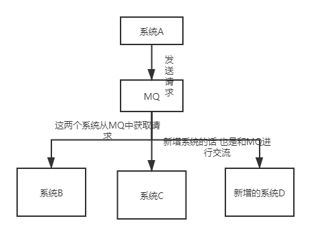
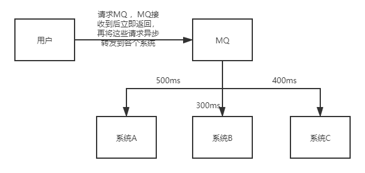
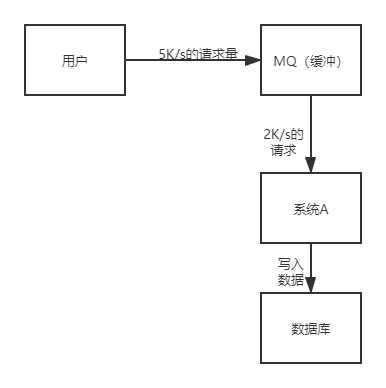

## 什么是消息队列

作为一个存放消息的容器，生产者将消息发送至其中，消费者从中获取消息，由这个容器作为中间件处理消息，完成生产者和消费者的交流。目前使用较多的消息队列有ActiveMQ，RabbitMQ，Kafka，RocketMQ。

另外，我们知道队列 Queue 是一种先进先出的数据结构，所以消费消息时也是按照顺序来消费的。比如生产者发送消息1,2,3...对于消费者就会按照1,2,3...的顺序来消费。但是偶尔也会出现消息被消费的顺序不对的情况，比如某个消息消费失败又或者一个 queue 多个consumer 也会导致消息被消费的顺序不对，我们一定要保证消息被消费的顺序正确。

## 消息队列的作用

- 解耦

若系统中的各个模块直接相互调用，那么当新增或者减少功能模块的时候，对系统的影响就会非常大，此时的系统之间的耦合度比较高，不符合开发规范。若各个模块之间的调用由消息队列这个容器管理，各个模块之间不会直接沟通，耦合度会大大降低，方便系统的扩展和修改。

- 异步

用户对同时对系统中的多个模块进行请求，每个模块的响应速度不同，会导致整个请求过程非常慢，当将用户的请求交给消息队列，由消息队列异步请求各个模块时，用户的请求速度会大大提高。

- 削峰

请求通过系统然后直接写入数据库时，在高并发的情况下，系统和数据库的压力会非常大。引入消息队列后，所有请求发送给消息队列，并立刻返回，此时消息队列作为一个缓冲区，降低请求压力，以较小的并发量访问系统并将数据写入数据库。

## 消息队列的缺点

- **系统可用性降低：** 系统可用性在某种程度上降低，为什么这样说呢？在加入MQ之前，你不用考虑消息丢失或者说MQ挂掉等等的情况，但是，引入MQ之后你就需要去考虑了！
- **系统复杂性提高：** 加入MQ之后，你需要保证消息没有被重复消费、处理消息丢失的情况、保证消息传递的顺序性等等问题！
- **一致性问题：** 我上面讲了消息队列可以实现异步，消息队列带来的异步确实可以提高系统响应速度。但是，万一消息的真正消费者并没有正确消费消息怎么办？这样就会导致数据不一致的情况了!

## 消息队列的使用场景

## 各大消息队列的介绍

**对比：**

对比方向概要吞吐量万级的 ActiveMQ 和 RabbitMQ 的吞吐量（ActiveMQ 的性能最差）要比 十万级甚至是百万级的 RocketMQ 和 Kafka 低一个数量级。可用性都可以实现高可用。ActiveMQ 和 RabbitMQ 都是基于主从架构实现高可用性。RocketMQ 基于分布式架构。 kafka 也是分布式的，一个数据多个副本，少数机器宕机，不会丢失数据，不会导致不可用时效性RabbitMQ 基于erlang开发，所以并发能力很强，性能极其好，延时很低，达到微秒级。其他三个都是 ms 级。功能支持除了 Kafka，其他三个功能都较为完备。 Kafka 功能较为简单，主要支持简单的MQ功能，在大数据领域的实时计算以及日志采集被大规模使用，是事实上的标准消息丢失ActiveMQ 和 RabbitMQ 丢失的可能性非常低， RocketMQ 和 Kafka 理论上不会丢失。

**总结：**

ActiveMQ 的社区算是比较成熟，但是较目前来说，ActiveMQ 的性能比较差，而且版本迭代很慢，不推荐使用。

RabbitMQ 在吞吐量方面虽然稍逊于 Kafka 和 RocketMQ ，但是由于它基于 erlang 开发，所以并发能力很强，性能极其好，延时很低，达到微秒级。但是也因为 RabbitMQ 基于 erlang 开发，所以国内很少有公司有实力做erlang源码级别的研究和定制。如果业务场景对并发量要求不是太高（十万级、百万级），那这四种消息队列中，RabbitMQ 一定是你的首选。如果是大数据领域的实时计算、日志采集等场景，用 Kafka 是业内标准的，绝对没问题，社区活跃度很高，绝对不会黄，何况几乎是全世界这个领域的事实性规范。

RocketMQ 阿里出品，Java 系开源项目，源代码我们可以直接阅读，然后可以定制自己公司的MQ，并且 RocketMQ 有阿里巴巴的实际业务场景的实战考验。RocketMQ 社区活跃度相对较为一般，不过也还可以，文档相对来说简单一些，然后接口这块不是按照标准 JMS 规范走的有些系统要迁移需要修改大量代码。还有就是阿里出台的技术，你得做好这个技术万一被抛弃，社区黄掉的风险，那如果你们公司有技术实力我觉得用RocketMQ 挺好的

kafka 的特点其实很明显，就是仅仅提供较少的核心功能，但是提供超高的吞吐量，ms 级的延迟，极高的可用性以及可靠性，而且分布式可以任意扩展。同时 kafka 最好是支撑较少的 topic 数量即可，保证其超高吞吐量。kafka 唯一的一点劣势是有可能消息重复消费，那么对数据准确性会造成极其轻微的影响，在大数据领域中以及日志采集中，这点轻微影响可以忽略这个特性天然适合大数据实时计算以及日志收集。

