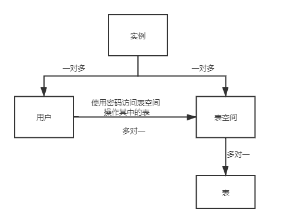
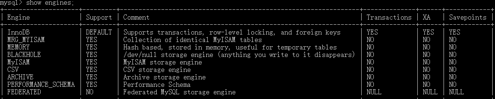
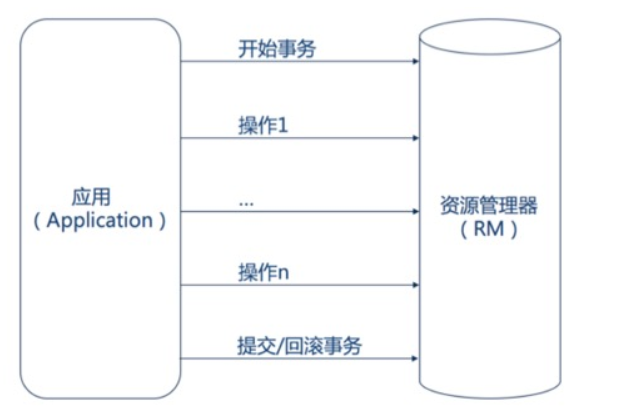
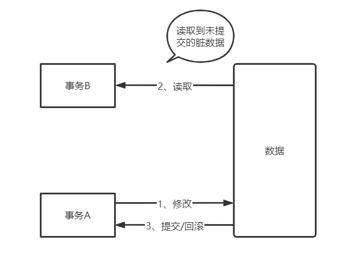
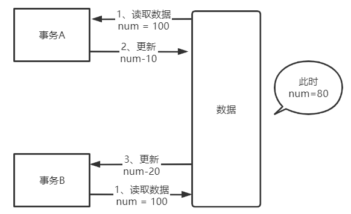
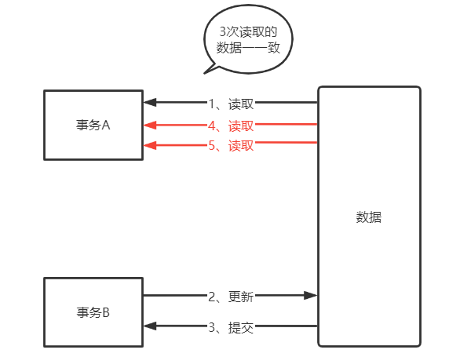
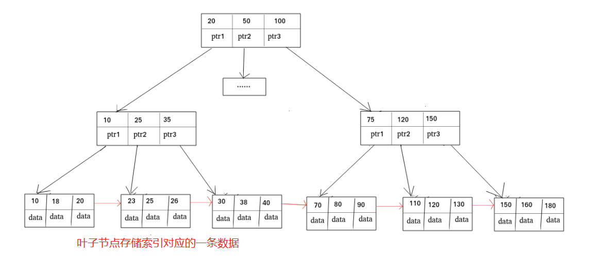
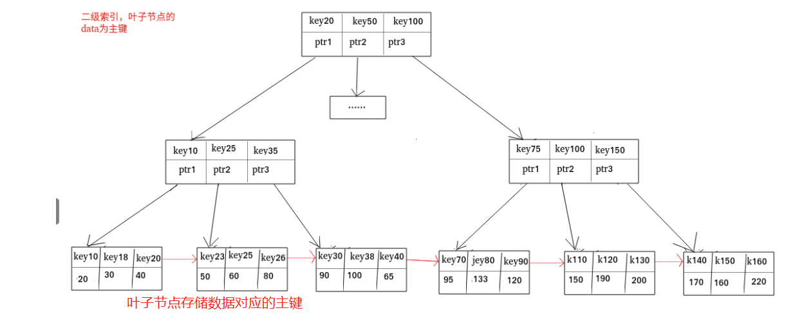

# 数据库中的对象

* 表(Table)

* 索引(Index)

* 视图(View)

* 图表(View)

* 缺省值(Default)

* 规则(Rule)

* 触发器(Trigger)

* 存储过程(Stored Procedure)

* 用户(User)

# 数据库层级关系



**说明**

- 实例

一个Oracle实例（Oracle Instance）有一系列的后台进程（Backguound Processes)和内存结构（Memory Structures)组成。一个数据库可以有n个实例。

- 用户

用户是在实例下创建的，不同的实例可以拥有相同名字的用户

- 表空间

表空间是一个用来管理数据存储逻辑概念，表空间只是和数据文件（ORA或者DBF文件）发生关系，数据文件是物理的，一个表空间可以包含多个数据文件，而一个数据文件只能隶属一个表空间。可以在表空间下创建表

- 数据文件

数据文件是数据库的物理存储单位。数据库的数据是存储在表空间中的，真 正是在某一个或者多个数据文件中。而一个表空间可以由一个或多个数据文件组成，一个数据文件只能属于一个表空间。一旦数据文件被加入到某个表空间后，就不能删除这个文件，如果要删除某个数据文件，只能删除其所属于的表空间才行。

- 注明

表的数据，是有用户放入某一个表空间的，而这个表空间会随机把这些表数据放到一个或者多个数据文件中。由于oracle的数据库不是普通的概念，oracle是有用户和表空间对数据进行管理和存放的。但是表不是有表空间去查询的，而是由用户去查的。因为不同用户可以在同一个表空间建立同一个名字的表！这里区分就是用户了！

**比喻：**

实例 = 工厂

表空间 = 仓库

用户 = 仓库中的工作人员

表 = 商品

仓库中的工作人员通过自己的钥匙（密码），可以进入仓库（登陆），一个仓库可以有多个工作人员但是每个工作人员只会在一个仓库工作。

仓库不属于任何工作人员

工作人员会有默认的工作仓库，如果不指定仓库，商品就会放在默认的仓库中。


# 数据类型

## MySQL中的数据类型

| 数据类型  | 描述                                     | 字节                                     | 推荐使用                                                     |
| --------- | ---------------------------------------- | ---------------------------------------- | ------------------------------------------------------------ |
| SMALLINT  | 整数，从-32000到 +32000范围              | 2                                        | 存储相对比较小的整数。比如: 年纪，数量                       |
| INT       | 整数，从-2000000000 到 +2000000000 范围  | 4                                        | 存储中等整数例如: 距离                                       |
| BIGINT    | 不能用SMALLINT 或 INT描述的超大整数。    | 8                                        | 存储超大的整数例如: 科学/数学数据                            |
| FLOAT     | 单精度浮点型数据                         | 4                                        | 存储小数数据例如:测量，温度                                  |
| DOUBLE    | 双精度浮点型数据                         | 8                                        | 需要双精度存储的小数数据例如:科学数据                        |
| DECIMAL   | 用户自定义精度的浮点型数据               | 变量;取决于精度与长度                    | 以特别高的精度存储小数数据。例如:货币数额，科学数据          |
| CHAR      | 固定长度的字符串                         | 特定字符串长度(高达255字符)              | 存储通常包含预定义字符串的变量例如: 定期航线，国家或邮编     |
| VARCHAR   | 具有最大限制的可变长度的字符串           | 变量; 1 + 实际字符串长度 (高达 255 字符) | 存储不同长度的字符串值(高达一个特定的最大限度).例如:名字，密码，短文标签 |
| TEXT      | 没有最大长度限制的可变长度的字符串       | Variable; 2 +聽 actual string length     | 存储大型文本数据例如: 新闻故事，产品描述                     |
| BLOB      | 二进制字符串                             | 变量；2 + 实际字符串长度                 | 存储二进制数据例如:图片，附件，二进制文档                    |
| DATE      | 以 yyyy-mm-dd格式的日期                  | 3                                        | 存储日期例如:生日，产品满期                                  |
| TIME      | 以 hh:mm:ss格式的时间                    | 3                                        | 存储时间或时间间隔例如:报警声，两时间之间的间隔，任务开始/结束时间 |
| DATETIME  | 以yyyy-mm-ddhh:mm:ss格式结合日期和时间   | 8                                        | 存储包含日期和时间的数据例如:提醒的人，事件                  |
| TIMESTAMP | 以yyyy-mm-ddhh:mm:ss格式结合日期和时间   | 4                                        | 记录即时时间例如：事件提醒器，“最后进入”的时间标记           |
| YEAR      | 以 yyyy格式的年份                        | 1                                        | 存储年份例如:毕业年，出生年                                  |
| ENUM      | 一组数据，用户可从中选择其中一个         | 1或 2个字节                              | 存储字符属性，只能从中选择之一例如:布尔量选择，如性别        |
| SET       | 一组数据，用户可从中选择其中0，1或更多。 | 从1到8字节;取决于设置的大小              | 存储字符属性，可从中选择多个字符的联合。例如:多选项选择，比如业余爱好和兴趣。 |


## Oracle数据类型

| 数据类型        | 参数                   | 描述                                                         |
| --------------- | ---------------------- | ------------------------------------------------------------ |
| char(n)         | n=1 to 2000字节        | 定长字符串，n字节长，如果不指定长度，缺省为1个字节长（一个汉字为2字节） |
| varchar2(n)     | n=1 to 4000字节        | 可变长的字符串，具体定义时指明最大长度n， 这种数据类型可以放数字、字母以及ASCII码字符集(或者EBCDIC等数据库系统接受的字符集标准)中的所有符号。 如果数据长度没有达到最大值n，Oracle 8i会根据数据大小自动调节字段长度， 如果你的数据前后有空格，Oracle 8i会自动将其删去。VARCHAR2是最常用的数据类型。 可做索引的最大长度3209。 |
| number(m,n)     | m=1 to 38 n=-84 to 127 | 可变长的数值列，允许0、正值及负值，m是所有有效数字的位数，n是小数点以后的位数。 如：number(5,2)，则这个字段的最大值是99,999，如果数值超出了位数限制就会被截取多余的位数。 如：number(5,2)，但在一行数据中的这个字段输入575.316，则真正保存到字段中的数值是575.32。 如：number(3,0)，输入575.316，真正保存的数据是575。 |
| date            | 无                     | 从公元前4712年1月1日到公元4712年12月31日的所有合法日期， Oracle 8i其实在内部是按7个字节来保存日期数据，在定义中还包括小时、分、秒。 缺省格式为DD-MON-YY，如07-11月-00 表示2000年11月7日。 |
| long            | 无                     | 可变长字符列，最大长度限制是2GB，用于不需要作字符串搜索的长串数据，如果要进行字符搜索就要用varchar2类型。 long是一种较老的数据类型，将来会逐渐被BLOB、CLOB、NCLOB等大的对象数据类型所取代。 |
| raw(n)          | n=1 to 2000            | 可变长二进制数据，在具体定义字段的时候必须指明最大长度n，Oracle 8i用这种格式来保存较小的图形文件或带格式的文本文件，如Miceosoft Word文档。 raw是一种较老的数据类型，将来会逐渐被BLOB、CLOB、NCLOB等大的对象数据类型所取代。 |
| long raw        | 无                     | 可变长二进制数据，最大长度是2GB。Oracle 8i用这种格式来保存较大的图形文件或带格式的文本文件，如Miceosoft Word文档，以及音频、视频等非文本文件。 在同一张表中不能同时有long类型和long raw类型，long raw也是一种较老的数据类型，将来会逐渐被BLOB、CLOB、NCLOB等大的对象数据类型所取代。 |
| blob clob nclob | 无                     | 三种大型对象(LOB)，用来保存较大的图形文件或带格式的文本文件，如Miceosoft Word文档，以及音频、视频等非文本文件，最大长度是4GB。 LOB有几种类型，取决于你使用的字节的类型，Oracle 8i实实在在地将这些数据存储在数据库内部保存。 可以执行读取、存储、写入等特殊操作。 |
| bfile           | 无                     | 在数据库外部保存的大型二进制对象文件，最大长度是4GB。 这种外部的LOB类型，通过数据库记录变化情况，但是数据的具体保存是在数据库外部进行的。 Oracle 8i可以读取、查询BFILE，但是不能写入。 大小由操作系统决定。 |


# 存储引擎

查看MySql存储引擎  `show engines;`




可以看出MySQL的默认存储引擎为 InnoDB ，在5.7版本中只有 InnoDB 支持事务

## MyISAM和InnoDB的区别

5.5版本之前MySQL的默认存储引擎是MyISAM，之后改为InnoDB（事务性存储引擎）

|    支持方面    |    MyISAM    |                      InnoDB                      |
| :------------: | :----------: | :----------------------------------------------: |
|       锁       | 只支持表级锁 |          支持行级锁和表级锁默认是行级锁          |
|      事务      |    不支持    |                       支持                       |
|      外键      |    不支持    |                       支持                       |
| 数据库崩溃恢复 |    不支持    | 支持，崩溃之后重启即可恢复之前状态依赖`redo log` |
|      MVCC      |    不支持    |                       支持                       |

**🌈扩展：**

- MySQL InnoDB 引擎使用 **redo log(重做日志)** 保证事务的**持久性**，使用 **undo log(回滚日志)** 来保证事务的**原子性**
- MySQL InnoDB 引擎通过 **锁机制**、**MVCC** 等手段来保证事务的隔离性（ 默认支持的隔离级别是 **`REPEATABLE-READ`** ）
- 保证了事务的持久性、原子性、隔离性之后，一致性才能得到保障
- **MVCC**就是行级锁的升级，有效减少加锁操作，提高性能


# 事务

**定义：**数据库事务可以保证多个对数据库的操作（多条SQL）构成一个逻辑上的整体。遵循一下四个特性：

* **原子性(Atomic)：**事务中各项操作，要么全部完成要么全部失败；事务执行的过程中发生错误就会回滚（Rollback）,数据回到事务执行之前的状态

* **一致性(Consistent)：**事务执行前后，数据保持一致。例如转账业务中，无论转账事务是否成功，双方的总额是不变的

* **隔离性(Isolated)：**并发操作数据库时，事务之间相互不会干扰，各个事务之间的数据库是独立的

* **持久性(Durable)：**事务完成后所做的改动都会被持久化

```sql
BEGIN TRANSACTION  //事务开始
SQL1
SQL2
COMMIT/ROLLBACK   //事务提交或回滚
```




## 并发事务会导致的问题

* **脏读（Dirty read）：**当事务A正在修改数据，但是未提交，事务B访问了该数据并使用。因为这个数据还未提交，那么事务B访问的就是 **脏数据**，执行的操作也是不准确的




* **丢失修改（Lost to modify）：**事务A访问数据时，事务B也访问了该数据，事务A对数据做了修改之后事务B也做了修改，那么事务A的修改结果将会丢失



* **不可重复读（Unrepeatableread）：**通常是针对 **更新（UPDATE）**操作。事务A多次访问一个数据，在事务执行过程中，事务B修改了该数据，导致事务A不同时刻访问的数据不一致



* **幻读（Phantom read）：**幻读与不可重复读类似，通常是针对数据 **插入（INSERT）**操作。当事务A执行过程中操作了数据但是未提交，事务B却插入了一些数据并且先提交，导致事务B发现了原来不存在的数据

🌈**不可重复读和幻读区别：**

不可重复读的重点在于修改比如多次获取数据由于另一个事务修改了数据导致读取数据不一致；幻读的重点在于新增和删除比如多次获取数据由于另一个事务新增或删除导致读取数据不一致


## 事务隔离级别

SQL定义了以下四种隔离级别：

**读未提交（ Read uncommitted）：** 最低隔离级别，允许读取未提交的数据，**可能导致脏读、不可重复读、幻读**

**读已提交（ Read committed）：** 允许读取并发事务已经提交的数据，**可以防止脏读，但仍会发生不可重复读、幻读**

**可重复读（Repeatable read）：**  对同一字段多次读取结果一致，除非事务自己==修改==，**可以防止脏读、不可重复读，但仍会发生幻读**

**可串行化（Serializable）：** 最高隔离级别，完全服从ACID。所有事务逐次执行，事务之间互不干扰

| 事务隔离级别                 | 脏读 | 不可重复读 | 幻读 |
| ---------------------------- | ---- | ---------- | ---- |
| 读未提交（read uncommitted） | 是   | 是         | 是   |
| 读已提交（read committed）   | 否   | 是         | 是   |
| 可重复读（repeatable read）  | 否   | 否         | 是   |
| 可串行化（serializable）     | 否   | 否         | 否   |


MySQL InnoDB引擎默认隔离级别是 **可重复读（repeatable read）**，可通过`SELECT @@tx_isolation;`命令查看，MySQL8.0改为`SELECT @@transaction_isolation;`

```sql
mysql> SELECT @@tx_isolation;
+-----------------+
| @@tx_isolation  |
+-----------------+
| REPEATABLE-READ |
+-----------------+
```


**🌈注意：**

要解决并发事务会导致的问题，就要提高事务的隔离级别，级别越高并发能力就越低

事务级别越低，锁就越少，大部分数据库默认的事务隔离级别是 **读已提交（read committed）**，但是InnoDB默认使用的**可重复读（repeatable read）**并不会有性能损失


# 锁

* **表级锁：**开销小，加锁快；不会出现死锁；锁定粒度大，发生锁冲突的概率最高，并发度最低。 

* **行级锁：**开销大，加锁慢；会出现死锁；锁定粒度最小，发生锁冲突的概率最低，并发度也最高。 

* **页面锁：**开销和加锁时间界于表锁和行锁之间；会出现死锁；锁定粒度界于表锁和行锁之间，并发度一般

🌈**注意：**

不同的存储引擎支持不同的锁机制

MyISAM和MEMORY采用表级锁

BDB存储引擎采用的是页面锁（page-level locking），但也支持表级锁

InnoDB存储引擎既支持行级锁（row-level locking），也支持表级锁，但默认情况下是采用行级锁


# 索引

**索引是用于快速查询和检索数据的数据结构。常用的索引结构有：B+树、Hash。**

索引可以大大提高数据的查询效率。比如我们要查“MySQL”这个字符，可以先定位到M开头的字符，再找y字符，以此类推；如果没有索引，我们就要遍历所有字符找到对应的字符。

## 优缺点

**优点：**

* 可以大大加快数据的检索速度（通过减少检索的数据量）
* 通过创建唯一索引（聚簇索引）可以保证数据库表中每一条数据的唯一性

**缺点：**

* 创建索引和维护索引会消耗资源，当对数据进行增删改操作时也会对索引进行动态修改，从而降低SQL的执行效率

* 索引要使用物理文件进行存储，会消耗一点空间

  

InnoDB引擎中每个表都有对应两个文件，frm文件存储表的信息，ibd文件存储索引和数据信息

**🌈注意：**

大部分情况下，索引查询的效率是高于全表查询的，但是当数据量不大时，使用索引也不一定能带来很大的提升


## 索引实现


### B+树

MySQL的InnoDB引擎的所有是使用B+树结构实现的


## 原理


like以%开头会导致索引失效而进行全局扫描

可以使用全文索引解决这个问题(`select id,fnum,fdst from dynamic_201606 where match(user_name) against('zhangsan' in boolean mode);`)

mysql查询的方式 即访问类型有

ALL：全表扫描

index：索引全扫描

range：索引范围扫描

ref：使用非唯一索引扫描

eq_ref：使用唯一索引扫描

const，system：单表中 最多只有一个匹配行

（性能越来越好）


## 分类

### 主键索引（PRIMAY KEY）

**数据表的主键列使用的索引，主键索引存储的对应的一条数据记录**

一张表只能有一个主键，不能为null不能重复

🌈在InnoDB中，如果没有设置主键，InnoDB会自动检查表中是否有唯一索引的字段，如果有则默认为主键，如果没有InnoDB会自动生成一个6Byte的自增主键



### 二级索引（辅助索引）

**二级索引中叶子节点存储的是数据的主键，通过二级索引可以定位到主键的位置，从而查询到数据**

* **唯一索引（UNIQUE）：**唯一索引的列不能重复，但数据可以为null，一张表可以有多个唯一索引。唯一索引大部分情况是为了保证数据的唯一性，而不是提高查询效率

* **常规索引（INDEX）：**唯一作用就是为了提高查询效率，一张表可以有多个常规索引，可以为null
* **前缀索引（Prefix）：**前缀索引只适用于字符串类型的字段。对字符串的前几个字符创建索引，比常规索引的数据量更小（只有前面几个字符）

* **全文索引（FULLTEXT）：**主要是为了检索大文本数据中的关键信息，是目前搜索引擎数据库使用的一种技术。Mysql5.6 之前只有 MYISAM 引擎支持全文索引，5.6 之后 InnoDB 也支持了全文索引。




## 负面影响

创建索引和维护索引需要耗费时间，这个时间随着数据量的增加而增加，同时索引也需要占用物理空间，当对表进行操作的时候索引也要进行动态维护，会降低数据的维护速度


## 创建索引的原则

在频繁使用，用以缩小查询范围的字段或者用以排序的字段上建立索引

对应很少涉及查询的列或重复值较多的列，不宜创建索引

对于特殊的数据类型的列，不宜创建索引如（text）

对于非常小的表，大部分情况下全局扫描更有效

对于大中型表，创建索引很合适

对于特大型表，创建索引的代价太大，一般使用分区技术进行一组的数据查询


## 索引的相关操作

1. 通过explain 查看sql是否使用索引

```sql
EXPLAIN SELECT * from `user` WHERE id = 1;
```

2. 创建普通索引

```sql
ALTER TABLE 表名 ADD INDEX(column);
```

3. 创建唯一索引

```sql
1.当索引字段存在时：
ALTER TABLE 表名 ADD UNIQUE(column);
alter table teacher add unique(age);
2.当索引字段不存在时：
ALTER TABLE 表名 ADD COLUMN TYPE UNIQUE;
alter table teacher add teacher_id int unique;
```

4. 创建全文索引

```sql
ALTER TABLE `dynamic_201606` ADD FULLTEXT INDEX `idx_user_name` (`user_name`);
```


# 数据库约束

## 五大约束

1.—-主键约束（Primay Key Coustraint） 唯一性，非空性

2.—-唯一约束 （Unique Counstraint）唯一性，可以空，但只能有一个

3.—-检查约束 (Check Counstraint) 对该列数据的范围、格式的限制（如：年龄、性别等）

4.—-默认约束 (Default Counstraint) 该数据的默认值

5.—-外键约束 (Foreign Key Counstraint) 需要建立两表间的关系并引用主表的列


## 五大约束的语法示例

1.—-添加主键约束（将stuNo作为主键）

```
alter table stuInfo add constraint PK_stuNo primary key (stuNo)
```

2.—-添加唯一约束（身份证号唯一，因为每个人的都不一样）

```
alter table stuInfo add constraint UQ_stuID unique(stuID)
```

3.—-添加默认约束（如果地址不填 默认为“地址不详”）

```
alter table stuInfo add constraint DF_stuAddress default (‘地址不详’) for stuAddress
```

4.—-添加检查约束 （对年龄加以限定 15-40岁之间）

```
alter table stuInfo add constraint CK_stuAge check (stuAge between 15 and 40)
```

```
alter table stuInfo add constraint CK_stuSex check (stuSex=’男’ or stuSex=’女′)
```

5.—-添加外键约束 (主表stuInfo和从表stuMarks建立关系，关联字段stuNo)

```
alter table stuInfo add constraint FK_stuNo foreign key(stuNo)references stuinfo(stuNo)
```


# 查询

## 连接

1. 左连接(left join)：显示左表所有数据和右表相应数据。
2. 右连接(right join)：显示右表所有数据加左表相应数据。
3. 内连接(inner join)：显示有效公共数据。
4. 全连接(full join)：显示所有数据。


## sql注入问题

通过web表单或者域名在请求时将sql输入形成字符串 后端没有进行处理而执行一些sql

### 解决方法

1. 对用户的输入进行校验，可以通过正则表达式，或限制长度，对单引号和双"-"进行转换等。
2. 不要使用动态拼装SQL，应使用参数化的SQL或者直接使用存储过程进行数据查询存取。
3. 不要使用管理员权限的数据库连接，为每个应用使用单独的权限有限的数据库连接。
4. 不要把机密信息明文存放，应加密或者Hash掉密码和敏感的信息。
5. 使用自定义的错误信息对原始错误信息进行包装，把异常信息存放在独立的表中。


## 分库后如何实现分页查询

1. 直接使用跨库的多表联合查询（不建议）
2. 向每个数据库均发送一个查询请求，然后对所有查询结果汇总，再处理分页逻辑
3. 建立一个总数据库，只负责维护主键和必要的索引，以供分页查询
4. 使用Redis维护一个主键序列，分页操作就是截取该序列的一部分，其结果就是主键ID集合，拿到ID后便可映射到多个数据库查询数据


# 数据库优化

## sql优化

少使用select*；

只查询一条记录时使用 limit 1；

使用连接查询代替子查询；

尽量使用一些能通过索引查询的关键字；


## 表结构优化

尽量使用数字类型的字段，提高比对效率；

长度不变且对查询速度要求高的数据可以考虑使用 char，否则使用 varchar；

表中字段过多时可以适当的进行垂直分割，将部分字段移动到另外一张表；

表中数据量过大可以适当的进行水平分割，将部分数据移动到另外一张表。


## 其他优化：

对查询效率高的字段适当建立索引提高效率；

根据表的用途使用合适的数据库引擎，读写分离；


# 存储过程

**定义：**Mysql储存过程是一组为了完成特定功能的SQL语句集，经过编译之后存储在数据库中，当需要使用该组SQL语句时用户只需要通过指定储存过程的名字并给定参数就可以调用执行它了，简而言之就是一组已经写好的命令，需要使用的时候拿出来用就可以了。


# 触发器

**定义：** 触发器（TRIGGER）是由事件来触发某个操作。这些操作包括INSERT语句、UPDATE语句和DELETE语句。当数据库系统执行这些操作时，会激活促发其执行自定义的相应的操作。


