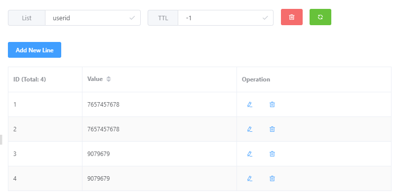
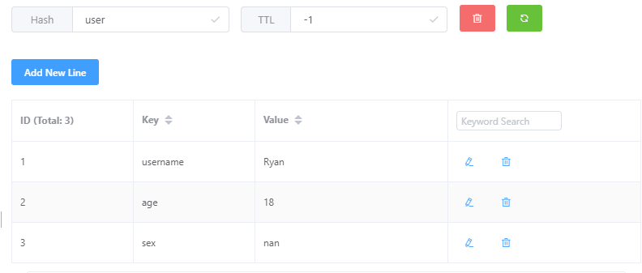
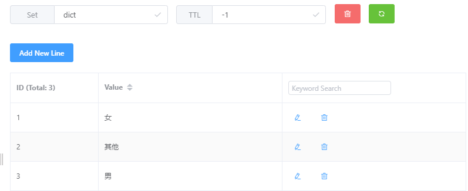
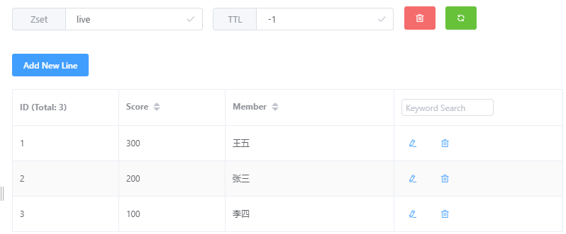
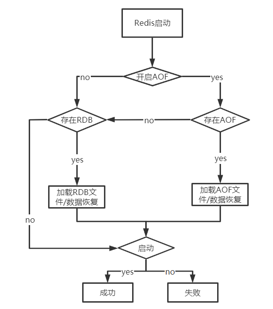
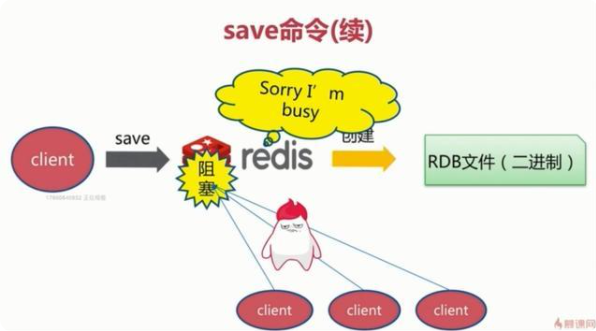
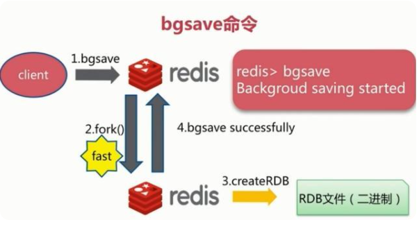
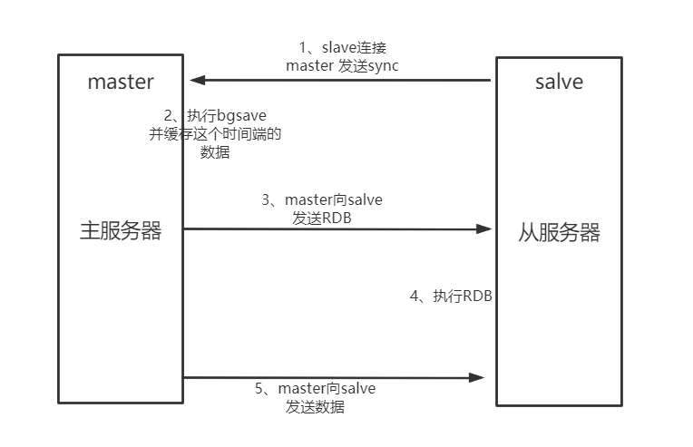
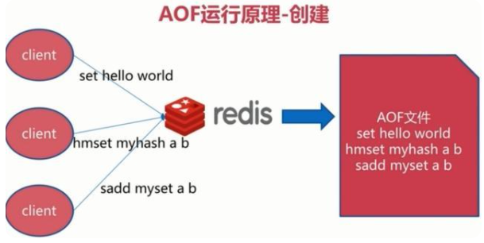
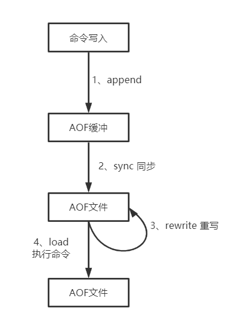

# 简单介绍

Redis是用C语言开发的NoSQL数据库，数据存储在内存中，即内存数据库，所以读写速度非常快。QPS可以达到10W

主要功能：缓存、分布式锁、消息队列......

支持事务、持久化、Lua脚本、集群、分布式、主从同步


# Redis 和 Memcached 的区别和共同点

## 共同点

1. 都是内存数据库，一般用来做缓存
2. 都有过期策略


## 不同点

1. Redis 支持的数据类型更丰富，Memcached 只支持最简单的 k/v 数据类型
2. Redis 支持数据持久化，就内存中的数据保存到磁盘中
3. Memcached 没有原生的集群模式，需要依靠客户端来实现往集群中分片写入数据；但是 Redis 目前是原生支持 cluster 模式的
4. Memcached 是多线程，非阻塞 IO 复用的网络模型；Redis 使用单线程的多路 IO 复用模型 （Redis 6.0 引入了多线程 IO ）
5. Redis 支持发布订阅模型、Lua 脚本、事务等功能，而 Memcached 不支持。并且，Redis 支持更多的编程语言
6. Memcached 过期数据的删除策略只用了惰性删除，而 Redis 同时使用了惰性删除与定期删除

# Redis数据结构及使用场景

## string

1. **介绍：**String类型数据结构存储的就是简单的key-value类型，value是一个对象
2. **常用命令：**`set,get,strlen,exists,decr,incr,setex`等
3. **应用场景：**一般用于存储计数，用户量、点击量、访问量等


## list

1. **介绍：**存储的是key-value类型，其中value是一个list集合（可重复）
2. **常用命令：**`rpush,lpop,lpush,rpop,lrange、llen` 等
3. **应用场景：**消息队列（先进先出）、慢查询（存储list结果集）、栈（先进后出）、消息流



## hash

1. **介绍：**存储的是key-filed-value类型，其中value是一个map集合
2. **常用命令：**`hset,hmset,hexists,hget,hgetall,hkeys,hvals` 等
3. **应用场景：**购物车



## set

1. **介绍：**存储的是key-value类型，其中value是一个set集合（无序不重复）
2. **常用命令：**`sadd,spop,smembers,sismember,scard,sinterstore,sunion` 等
3. **应用场景：**存储不能重复的数据集合、获取多个数据集的交集并集



## zset(sorted set)

1. **介绍：**与set相比增加了一个 score 权重参数，使set集合通过这个权重参数进行排序，或者通过score范围进行获取数据
2. **常用命令：**`zadd,zcard,zscore,zrange,zrevrange,zrem` 等
3. **应用场景：**需要对不重复数据进行按某个属性进行排序。如学生的考试成绩排行、直播人数排行



## bitmap

1. **介绍：**操作String类型的key所对应的偏移量上的位，返回原位置的值（二级制存 0，1）
2. **常用命令：** `setbit 、getbit 、bitcount、bitop`等
3. **应用场景：**保存状态信息等一些只有 0 1值的数据

# Redis数据过期

因为内存资源有限，部分数据也无需永久保存

## 设置过期

```
127.0.0.1:6379> expire key  60 # 数据在 60s 后过期
(integer) 1
127.0.0.1:6379> setex key 60 value # 数据在 60s 后过期 (setex:[set] + [ex]pire)
OK
127.0.0.1:6379> ttl key # 查看数据还有多久过期
(integer) 56
```

**🌈注意：**只有String类型的可以使用==setex==设置过期，其他类型的只能使用==expire==设置过期时间


## Redis如何判断数据是否过期

Redis中通过过期字典（类似hash表）来保存数据的过期时间。key为Redis中设置过期值的key，value为其过期时间（long型，毫秒精度的unix时间戳）


## 过期数据的删除策略

1. **惰性删除：**只会在使用key时才会进行进行过期检查。对CPU友好，但会造成大量key已过期未被删除
2. **定期删除：**定期抽取一点的key进行过期检查，会限制执行删除操作的时长和次数。对内存友好

Reids采用的是**定期删除+惰性/懒汉式删除** ，但还是会存在大量过期key未被清理的情况，可能出现 out of memory，所以使用 **Redis内存淘汰机制**


**Redis内存淘汰机制：**

Redis 提供 6 种数据淘汰策略：

1. **volatile-lru（least recently used）**：从已设置过期时间的数据集（server.db[i].expires）中挑选最近最少使用的数据淘汰
2. **volatile-ttl**：从已设置过期时间的数据集（server.db[i].expires）中挑选将要过期的数据淘汰
3. **volatile-random**：从已设置过期时间的数据集（server.db[i].expires）中任意选择数据淘汰
4. **allkeys-lru（least recently used）**：当内存不足以容纳新写入数据时，在键空间中，移除最近最少使用的 key（这个是最常用的）
5. **allkeys-random**：从数据集（server.db[i].dict）中任意选择数据淘汰
6. **no-eviction**：禁止驱逐数据，也就是说当内存不足以容纳新写入数据时，新写入操作会报错。这个应该没人使用吧！

4.0 版本后增加以下两种：

1. **volatile-lfu（least frequently used）**：从已设置过期时间的数据集(server.db[i].expires)中挑选最不经常使用的数据淘汰
2. **allkeys-lfu（least frequently used）**：当内存不足以容纳新写入数据时，在键空间中，移除最不经常使用的 key


# Redis持久化

持久化就是将数据写入硬盘中，Redis中提供快照（ROB）和追加文件（AOF）两种方式实现持久化



## RDB

在指定时间间隔内将Redis中的数据快照写入磁盘（二进制文件，默认的文件名为dump.rdb），实际操作就是fork一个子进程，将数据写入临时文件，再覆盖之前的文件，这个也是默认的持久化方式

### 执行流程

1. 执行bgsave命令时，Redis主进程会检查是否有子线程正在执行RDB\AOF任务，如果有直接返回
2. Redis主进程会fork一个子进程（这个操作会造成主进程阻塞）
3. 在子进程中执行RDB操作，将内存数据写入临时的快照文件，持久化完成后使用的新的临时文件替换之前的文件（RDB操作过程中，主进程的读写不受影响，产生的数据不会写入内存中而是写入一个临时的内存区域作为副本）
4. 子进程结束后会发送消息给主进程，通知RDB完成（将上个阶段内存副本中的数据同步到主内存中）


### 触发机制

RDB的触发机制分为：手动出发、自动触发

**手动触发：**

* save命令：因为Redis是单线程的所有会阻塞主线程，Redis不能处理其他的命令，直至RDB操作完成。如果数据量很大那么就会造成线程阻塞。

  

* bgsave命令：会将Redis主线程fork一个子线程（利用操作系统的Copy On Write机制），在这个子线程中执行RDB操作。Redis主线程只会在fork阶段阻塞下，时间较短

  

|                      |        save        |            bgsave            |
| :------------------: | :----------------: | :--------------------------: |
| IO类型（备份数据时） |        同步        |             异步             |
|         阻塞         |         是         | 只在fork主进程时才会造成阻塞 |
|        复杂度        |        O(n)        |             O(n)             |
|         优点         | 不会消耗额外的内存 |       不阻塞客户端命令       |
|         缺点         |   阻塞客户端命令   |  fork是重量级操作会消耗内存  |


**自动触发：**

场景一：使用redis.conf配置文件，当触发规则时就自动执行

```
# 当在规定的时间内，Redis发生了写操作的个数满足条件，会触发发生BGSAVE命令。
# save <seconds> <changes>
# 当用户设置了多个save的选项配置，只要其中任一条满足，Redis都会触发一次BGSAVE操作
save 900 1    #900秒之内至少一次写操作
save 300 10   #300秒之内至少发生10次写操作
save 60 10000 #60秒之内发生至少10000次写操作
```


场景二：服务器异常关闭，如果没有开启AOF，那么会自动执行一次bgsave

场景三：主从同步



### 优缺点

**优点**

* RBD二进制文件较小，适合全量备份，每隔一段时间进行bgsave备份，拷贝rdb文件用作灾难备份
* RDB恢复数据的速度比AOF快，因为RDB备份的是内存的存储的数据；而AOF存储的是命令数据量大，恢复时需要重新执行这些命令

**缺点**

* RDB有触发策略所以无法实时持久化，对于一些实时性要求高的场景不适合，持久化过程中主进程数据修改子进程无法同步会造成数据丢失
* RDBfork主进程属于重量级操作，会阻塞Redis主进程消耗内存
* 老版本Redis不兼容新版本的RDB文件

## AOF

以日志的形式记录Redis处理的==写操作命令==（查询操作除外），再存储到AOF文件中（默认appendonly.aof）。AOF日志文件会在运行中持续增长，Redis重启时需要==优先加载AOF日志中的指令==进行恢复数据，所以这个过程很耗时。需要定时对AOF进行重写，对日志文件进行瘦身。目前AOF是主流的Redis持久化方式




### 执行流程

AOF的工作流程操作：命令写入 （append）、文件同步（sync）、文件重写（rewrite）、重启加载 （load）



1. 所有命令追加写入到aof_buf（缓冲区）
2. aof缓冲区根据触发机制将数据同步到硬盘写入aof文件
3. 随着aof文件越来越大，需要根据策略对aof文件进行重写、压缩
4. 重启Redis时会优先加载aof文件以恢复数据


### 触发机制

AOF触发机制有三种，通过修改redi.conf文件中的appendfsync进行配置

AOF默认是关闭的，通过redi.conf进行配置开启

```
## 此选项为aof功能的开关，默认为“no”，可以通过“yes”来开启aof功能  
## 只有在“yes”下，aof重写/文件同步等特性才会生效  
appendonly yes  

## 指定aof文件名称  
appendfilename appendonly.aof  

## 指定aof操作中文件同步策略，有三个合法值：always everysec no,默认为everysec 
appendfsync everysec   #每秒钟同步一次

## 在aof-rewrite期间，appendfsync是否暂缓文件同步，"no"表示“不暂缓”，“yes”表示“暂缓”，默认为“no”  
no-appendfsync-on-rewrite no  
```

* **always：**同步持久化，每次数据变更就立即写入aof文件，性能差数据更完整
* **everysec：**异步持久化，每秒记录一次数据
* **no：**让操作系统决定何时进行同步


### **AOF文件重写**

因为持久化的aof文件会越来越大，为了压缩这个文件

**手动触发：**直接调用bgrewriteaof命令进行重写

**自动触发：**根据auto-aof-rewrite-min-size和auto-aof-rewrite-percentage参数确定自动触发时机

```
## aof文件rewrite触发的最小文件尺寸(mb,gb),只有大于此aof文件大于此尺寸是才会触发rewrite，默认“64mb”，建议“512mb”  
auto-aof-rewrite-min-size 64mb  

## 相对于“上一次”rewrite，本次rewrite触发时aof文件应该增长的百分比  
## 每一次rewrite之后，redis都会记录下此时“新aof”文件的大小(例如A)
## aof文件增长到A*(1 + p)之后，触发下一次rewrite，每一次aof记录的添加，都会检测当前aof文件的尺寸。  
auto-aof-rewrite-percentage 100
```


### 优缺点

**优点**

* AOF更能保证数据的完整性，一秒同步一次，最多丢失一秒的数据
* AOF写日志文件没有
* AOF日志文件可读性更高。如果执行了flushall命令清空了数据，

**缺点**

* AOF文件较大需要不断重写进行瘦身，但这个还是文本文件相较于RDB的二进制文件还是较大
* AOF开启后，支持的QPS相较于RDB会降低，因为AOF一般配置成每秒同步一次数据，性能还是会有所降低的
* AOF恢复数据时需要重新执行命令，速度慢


# Redis高并发出现的问题

## 缓存穿透

大量请求的key在缓存和数据库中都不存在，导致请求直接到了数据库上（但是数据库也不存在该数据所以缓存无法更新导致一直请求数据库）。

例子：黑客利用不存在的key发起大量请求，这些请求都落到了数据库上，导致数据库出现问题

**解决方案**

1. 做好参数校验，拦截一些非法的参数请求
2. 对于缓存和数据库中都不存在的数据，可以在缓存中设置key-value的value=null，过期时间短一点为30S，可以避免用户用同样的key重复请求攻击
3. 采用布隆过滤

## 缓存雪崩

Redis重启或者一段时间内大量缓存数据失效，导致请求都落到数据库，数据库压力山大

**解决方案**

1. 针对Redis宕机重启，可以搭建Redis集群
2. 限流，避免同时处理大量请求
3. 针对数据失效，可以设置不同的失效时间，避免数据在同一时间大量失效，或者设置缓存永不失效

## 缓存击穿

数据在缓存中不存在但是在数据库中存在（一般是过期了），此时大量请求过来引起数据库压力瞬间增大。

**解决方案**


🌈和缓存雪崩不同的是，缓存击穿指的是同一条数据过期，雪崩指的是大量不同数据过期。


# 重要使用场景

## 分布式ID

## 分布式锁

