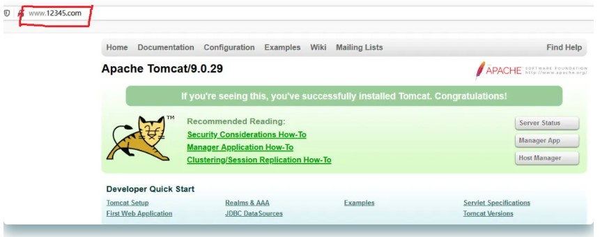
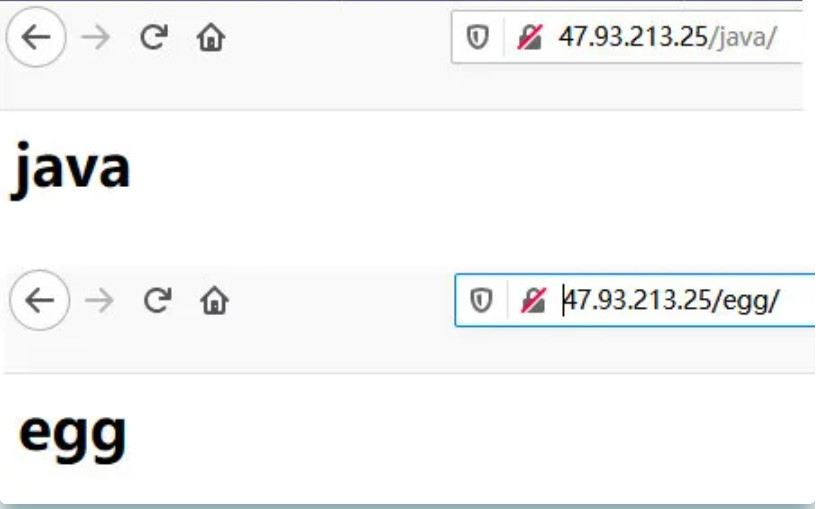
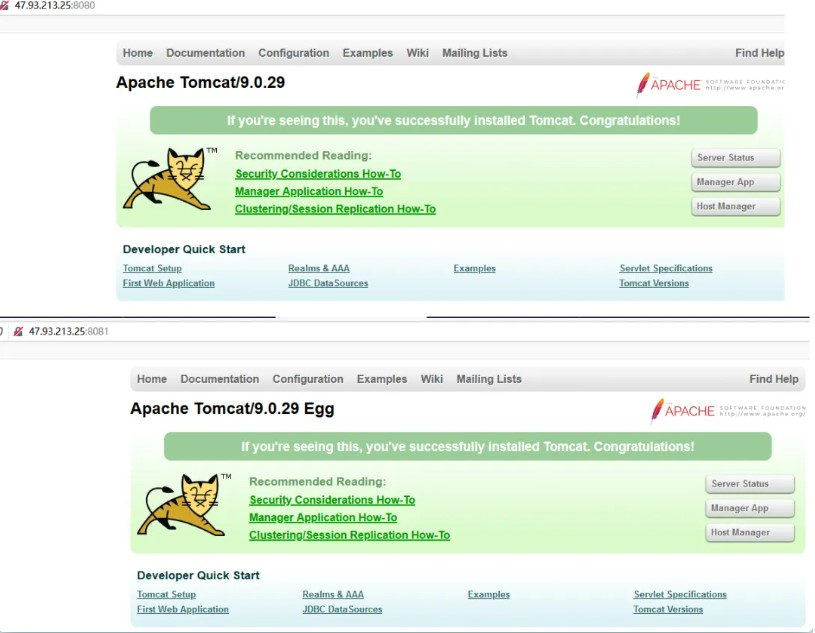
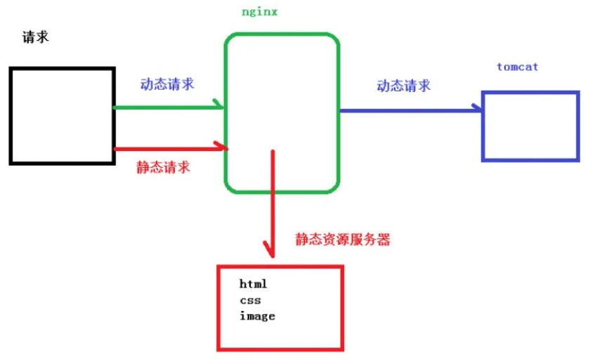
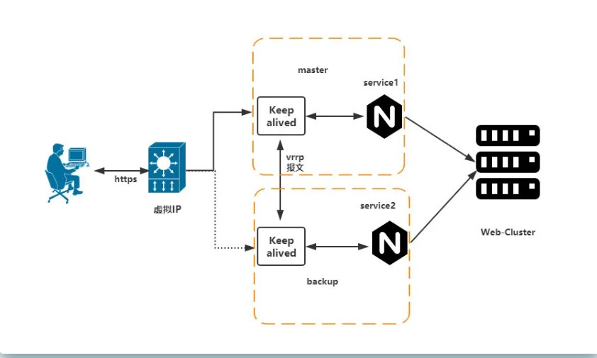

# 一、反向代理demo1

实现效果：使用 nginx 反向代理，访问 test.com 直接跳转到自己的机器 127.0.0.1:8080

1. 启动一个 tomcat，浏览器地址栏输入 127.0.0.1:8080，出现如下界面

   

2. 通过修改本地 host 文件（C:\Windows\System32\drivers\etc），添加`127.0.0.1 www.12345.com`将 www.12345.com 映射到自己的机器ip上

3. 配置完成之后，我们便可以通过 www.test.com:8080 访问到第一步出现的 Tomcat 初始界面。那么如何只需要输入 www.12345.com 便可以跳转到 Tomcat 初始界面呢？便用到 nginx 的反向代理。
4. 修改nginx.conf 配置文件，增加如下配置 `proxy_pass`

```shell
server {
        listen       80;
        server_name  localhost;
        #charset koi8-r;
        #access_log  logs/host.access.log  main;
        location / {
               proxy_pass http://127.0.0.1:8080;
        }

```

5. 如上配置，我们监听 80 端口，访问域名为 www.12345.com，不加端口号时默认为 80 端口，故访问该域名时会跳转到 127.0.0.1:8080 路径上。在浏览器端输入 www.12345.com 结果如下：


# 二、反向代理demo2

实现效果：使用 nginx 反向代理，根据访问的路径跳转到不同端口的服务中

访问 http://127.0.0.1/java/ 直接跳转到 127.0.0.1:8080

访问 http://127.0.0.1/egg/ 直接跳转到 127.0.0.1:8081

1. 在服务器上起两个tomcat，修改其中一个端口号为8081；在tomcat/webapps/目录下的各加两个文件夹，并随便写个html页面），我建的是java/index.html和egg/index.html

2. 修改nginx.conf，在http块中添加serve{}

   ```shell
   server {
           listen       80;
           server_name  localhost;
           #charset koi8-r;
           #access_log  logs/host.access.log  main;
           location / {
                  proxy_pass http://127.0.0.1:8080;
           }
   ```

   

3. 重启nginx，验证效果

   

# 三、Nginx负载均衡

随着互联网信息的爆炸性增长，负载均衡（load balance）已经不再是一个很陌生的话题， 顾名思义，负载均衡即是将负载分摊到不同的服务单元，

既保证服务的可用性，又保证响应足够快，给用户很好的体验。快速增长的访问量和数据流量催生了各式各样的负载均衡产品， 很多专业的负载均衡硬件提供了很好的功能，

但却价格不菲，这使得负载均衡软件大受欢迎， nginx 就是其中的一个，在 linux 下有 Nginx、LVS、Haproxy 等等服务可以提供负载均衡服务。

Nginx的负载均衡是proxy模块和upstream模块搭配实现的。upstream模块将会启用一个新的配置区段，在该区段定义了一组上游服务器。

实现效果：配置负载均衡

1. 同时启动两个Tomcat（为了方便验证效果，修改tomcat端口号的同时，顺便将Tomcat默认欢迎页面apache-tomcat-9.0.29/webapps/ROOR目录下的index.jsp修改下，看下8081欢迎页的“蛋蛋”没）

2. 

3. 修改nginx.conf

   ```shell
   server {
           listen       80;
           server_name  localhost;
   
           location ~ /java/ {
               proxy_pass http://127.0.0.1:8080;
           }
   
           location /egg/ {
               proxy_pass http://127.0.0.1:8081;
           }
   }
   ```

   

4. 重启nginx，验证效果（默认轮询的方式，每次打开新窗口，8080和8081会交替出现，同一个窗口的话需要关闭浏览器缓存)

**Nginx 分配策略：**

1. 轮询（默认） 每个请求按时间顺序逐一分配到不同的后端服务器，如果后端服务器 down 掉，能自动剔除

2. weight weight 代表权,重默认为 1,权重越高被分配的客户端越多 指定轮询几率，weight 和访问比率成正比，用于后端服务器性能不均的情况。例如：

   ```shell
   upstream server_pool{
   	server 192.168.5.21 weight=10;
   	server 192.168.5.22 weight=10;
    }
   ```

   

3. ip_hash 每个请求按访问 ip 的 hash 结果分配，这样每个访客固定访问一个后端服务器，可以解决 session 的问题。例如：

   ```shell
   upstream server_pool
   {
   	ip_hash; server 192.168.5.21:80;
   	server 192.168.5.22:80;
   }
   ```

   

4. fair（第三方） 按后端服务器的响应时间来分配请求，响应时间短的优先分配。

# 四、Nginx 配置-动静分离

Nginx 动静分离简单来说就是把动态跟静态请求分开，不能理解成只是单纯的把动态页面和静态页面物理分离。

严格意义上说应该是动态请求跟静态请求分开，可以理解成使用 Nginx 处理静态页面，Tomcat 处理动态页面。

动静分离从目前实现角度来讲大致分为两种， 一种是纯粹把静态文件独立成单独的域名，放在独立的服务器上，

也是目前主流推崇的方案；另外一种方法就是动态跟静态文件混合在一起发布，通过 nginx 来分开。

通过 location 指定不同的后缀名实现不同的请求转发。通过 expires 参数设置，可以使浏览器缓存过期时间，

减少与服务器之前的请求和流量。具体 Expires 定义：是给一个资 源设定一个过期时间，也就是说无需去服务端验证，

直接通过浏览器自身确认是否过期即可， 所以不会产生额外的流量。此种方法非常适合不经常变动的资源。

（如果经常更新的文件， 不建议使用 Expires 来缓存），我这里设置 3d，表示在这 3 天之内访问这个 URL，发送 一个请求，

比对服务器该文件最后更新时间没有变化，则不会从服务器抓取，返回状态码 304，如果有修改，则直接从服务器重新下载，返回状态码 200。



1.服务器找个目录存放自己的静态文件


2.修改nginx.conf

 

```shell
server {
        listen       80;
        server_name  localhost;
        location /static/ {
            root   /usr/data/www;
        }
        location /image/ {
             root /usr/data/;
             autoindex on;
        }
```


3.`./nginx -s reload`，验证效果


添加监听端口、访问名字 重点是添加 location， 最后检查 Nginx 配置是否正确即可，然后测试动静分离是否成功，

之需要删除后端 tomcat 服务器上的某个静态文件，查看是否能访问，如果可以访问说明静态资源 nginx 直接返回 了，不走后端 tomcat 服务器

# 五、Nginx的Rewrite

Rewrite是Nginx服务器提供的一个重要的功能，它可以实现URL重写和重定向功能。场景：URL访问跳转，支持开发设计。页面跳转、兼容性支持(新旧版本更迭)、展示效果(网址精简)等SEO优化(Nginx伪静态的支持)后台维护、流量转发等安全(动态界面进行伪装)该指令是通过正则表达式的使用来改变URI。可以同时存在一个或多个指令。需要按照顺序依次对URL进行匹配和处理。该指令可以在server块或location块中配置，其基本语法结构如下：

 

```shell
rewrite regex replacement [flag];
```


1. 采用反向代理demo2中的例子，修改nginx.conf(只多加了一行rewrite)

 

```shell
server {
        listen       80;
        server_name  localhost;

        location /java/ {
            proxy_pass http://127.0.0.1:8080;
            rewrite ^/java /egg/ redirect;
        }

        location /egg/ {
            proxy_pass http://127.0.0.1:8081;
        }
}
```


2. `./nginx -s reload`，验证效果（输入ip/java/被重定向到了egg）


rewrite指令可以在server块或location块中配置，其基本语法结构如下：

 

```
rewrite regex replacement [flag];
```


**rewrite**的含义：该指令是实现URL重写的指令。**regex**的含义：用于匹配URI的正则表达式。**replacement**：将regex正则匹配到的内容替换成 replacement。**flag: flag**标记，flag有如下值：**last:** 本条规则匹配完成后，继续向下匹配新的location URI 规则。(不常用)**break:** 本条规则匹配完成即终止，不再匹配后面的任何规则(不常用)。**redirect:** 返回302临时重定向，浏览器地址会显示跳转新的URL地址。**permanent:** 返回301永久重定向。浏览器地址会显示跳转新的URL地址。

 

```
rewrite ^/(.*) http://www.360.cn/$1 permanent;
```


# 六、Nginx高可用

如果将Web服务器集群当做一个城池，那么负载均衡服务器就相当于城门。如果“城门”关闭了，与外界的通道就断了。

如果只有一台Nginx负载服务器，当故障宕机的时候，就会导致整个网站无妨访问。所以我们需要两台以上Nginx来实现故障转移和高可用。



## 配置高可用

### 双机热备方案

这种方案是国内企业中最为普遍的一种高可用方案，双机热备其实就是指一台服务器在提供服务，另一台为某服务的备用状态，当一台服务器不可用另外一台就会顶替上去。

**keepalived是什么**

**`Keepalived`软件起初是专为`LVS`负载均衡软件设计的，用来管理并监控LVS集群系统中各个服务节点的状态，**

**后来又加入了可以实现高可用的`VRRP (Virtual Router Redundancy Protocol ,虚拟路由器冗余协议）`功能。**

**因此，`Keepalived`除了能够管理LVS软件外，还可以作为其他服务`（例如：Nginx、Haproxy、MySQL等）`的高可用解决方案软件
**

### 故障机转移机制

`Keepalived`高可用服务之间的故障切换转移，是通过`VRRP` 来实现的。在 `Keepalived`服务正常工作时，

主 `Master`节点会不断地向备节点发送（多播的方式）心跳消息，用以告诉备`Backup`节点自己还活着，

当主 `Master`节点发生故障时，就无法发送心跳消息，备节点也就因此无法继续检测到来自主 `Master`节点的心跳了，

于是调用自身的接管程序，接管主Master节点的 IP资源及服务。而当主 Master节点恢复时，

备Backup节点又会释放主节点故障时自身接管的IP资源及服务，恢复到原来的备用角色。

### 实现

准备两台安装Nginx和keepaliver(`yum install keepalived -y`)的服务器修改两台服务器上的/etc/keepalived/keepalived.conf

 

```shell
#主机
#检测脚本
vrrp_script chk_http_port {
    script "/usr/local/src/check_nginx.sh" #心跳执行的脚本，检测nginx是否启动
    interval 2                          #（检测脚本执行的间隔，单位是秒）
    weight 2                            #权重
}
#vrrp 实例定义部分
vrrp_instance VI_1 {
    state MASTER            # 指定keepalived的角色，MASTER为主，BACKUP为备
    interface ens33         # 当前进行vrrp通讯的网络接口卡(当前centos的网卡) 用ifconfig查看你具体的网卡
    virtual_router_id 66    # 虚拟路由编号，主从要一直
    priority 100            # 优先级，数值越大，获取处理请求的优先级越高
    advert_int 1            # 检查间隔，默认为1s(vrrp组播周期秒数)
    #授权访问
    authentication {
        auth_type PASS #设置验证类型和密码，MASTER和BACKUP必须使用相同的密码才能正常通信
        auth_pass 1111
    }
    track_script {
        chk_http_port            #（调用检测脚本）
    }
    virtual_ipaddress {
        192.168.16.150            # 定义虚拟ip(VIP)，可多设，每行一个
    }
}
```


 

```shell
# 备机
#检测脚本
vrrp_script chk_http_port {
    script "/usr/local/src/check_nginx.sh" #心跳执行的脚本，检测nginx是否启动
    interval 2                          #（检测脚本执行的间隔）
    weight 2                            #权重
}
#vrrp 实例定义部分
vrrp_instance VI_1 {
    state BACKUP                        # 指定keepalived的角色，MASTER为主，BACKUP为备
    interface ens33                      # 当前进行vrrp通讯的网络接口卡(当前centos的网卡) 用ifconfig查看你具体的网卡
    virtual_router_id 66                # 虚拟路由编号，主从要一直
    priority 99                         # 优先级，数值越大，获取处理请求的优先级越高
    advert_int 1                        # 检查间隔，默认为1s(vrrp组播周期秒数)
    #授权访问
    authentication {
        auth_type PASS #设置验证类型和密码，MASTER和BACKUP必须使用相同的密码才能正常通信
        auth_pass 1111
    }
    track_script {
        chk_http_port                   #（调用检测脚本）
    }
    virtual_ipaddress {
        192.168.16.150                   # 定义虚拟ip(VIP)，可多设，每行一个
    }
}
```


  3、新建检测脚本(`chmod 775 check_nginx.sh`)

 

```shell
#!/bin/bash
#检测nginx是否启动了
A=`ps -C nginx --no-header |wc -l`
if [ $A -eq 0 ];then    #如果nginx没有启动就启动nginx
      systemctl start nginx                #重启nginx
      if [ `ps -C nginx --no-header |wc -l` -eq 0 ];then    #nginx重启失败，则停掉keepalived服务，进行VIP转移
              killall keepalived
      fi
fi
```


  4、启动Nginx和keepalived(`systemctl start keepalived.service`)

  5、模拟Nginx故障（关闭主服务器Nginx），验证，仍可以通过配置的虚拟ip访问，ok