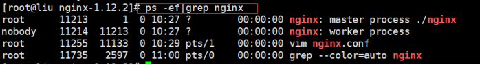
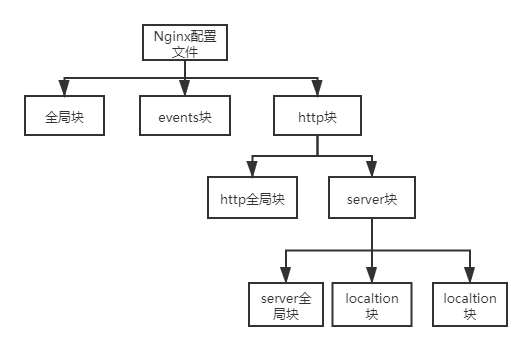
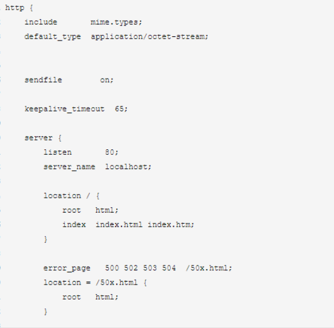
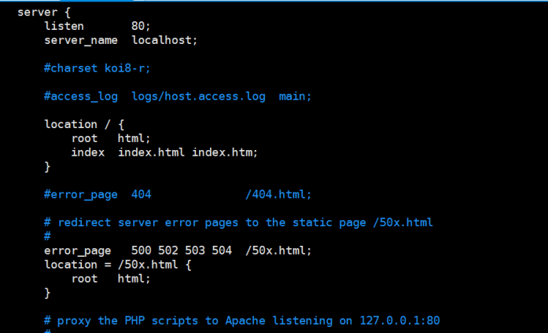

# **一、Nginx常用命令**

进入 nginx 目录中: cd /usr/local/nginx/sbin

**1.查看 nginx 版本号**

./nginx -v

**2.启动 nginx**

./nginx

查看是否启动成功：ps -ef|grep nginx



**3.停止 nginx**

./nginx -s stop

**4.重新加载 nginx**

./nginx -s reload

# 二、Nginx配置文件说明


## 2.1Nginx配置语法

- 配置文件由指令和指令块构成
- 每条指令以分号（;）结尾，指令和参数间以空格符分隔
- 指令块以大括号{}将多条指令组织在一起
- include语句允许组合多个配置文件以提高可维护性
- 使用 # 添加注释
- 使用 $ 定义变量
- 部分指令的参数支持正则表达式

**nginx.conf 配置文件主要分为三部分：全局块、events块、http块。**



## 2.2全局块

从配置文件开始到 events 块之间的内容，主要会设置一些影响 nginx 服务器整体运行的配置指令，主要包括配

置运行 Nginx 服务器的用户（组）、允许生成的 worker process 数，进程 PID 存放路径、日志存放路径和类型以

及配置文件的引入等。

比如上面第一行配置的：

这是 Nginx 服务器并发处理服务的关键配置，worker_processes 值越大，可以支持的并发处理量也越多，但是

会受到硬件、软件等设备的制约

 

```shell
#user nobody;
worker_processes  4;

#error_log  /logs/error.log;
#error_log  /logs/error.log  notice;
#error_log  /logs/error.log  info;

#pid    logs/nginx.pid
```

## 2.3events块

events 块涉及的指令主要影响 Nginx 服务器与用户的网络连接，常用的设置包括是否开启对多 work process 下的网络连接进行序列化，

是否允许同时接收多个网络连接，选取哪种事件驱动模型来处理连接请求，每个 word process 可以同时支持的最大连接数等。

 

```shell
events {
    #每个 work process 支持的最大连接数为 1024.
    worker_connections  1024;
}
```

## 2.4http块

这算是 Nginx 服务器配置中最频繁的部分，代理、缓存和日志定义等绝大多数功能和第三方模块的配置都在这里。

需要注意的是：http 块也可以包括 http 全局块、server 块。



### 2.4.1http全局块

http 全局块配置的指令包括文件引入、MIME-TYPE 定义、日志自定义、连接超时时间、单链接请求数上限等。

 

```shell
http {
    include       mime.types;
    default_type  application/octet-stream;
    sendfile        on;
    keepalive_timeout  65;
}
```

### 2.4.2server块

这块和虚拟主机有密切关系，虚拟主机从用户角度看，和一台独立的硬件主机是完全一样的，该技术的产生是为了 节省互联网服务器硬件成本。

每个 http 块可以包括多个 server 块，而每个 server 块就相当于一个虚拟主机。

而每个 server 块也分为全局 server 块，以及可以同时包含多个 location 块。（套娃）



- **全局server块**

也被叫做“虚拟服务器”部分，它描述的是一组根据不同server_name指令逻辑分割的资源，这些虚拟服务器响应HTTP请求，因此都包含在http部分。

最常见的配置是本虚拟机主机的监听配置和本虚拟主机的名称或 IP 配置。

 

```shell
server {
  listen       80;
  #server_name也支持通配符，*.example.com、www.example.*、.example.com
  server_name  localhost;
  #charset koi8-r;
  #access_log  logs/host.access.log  main;
}
```

- **localtion块**

一个 server 块可以配置多个 location 块。

这块的主要作用是基于 Nginx 服务器接收到的请求字符串（例如 server_name/uri-string），

对虚拟主机名称 （也可以是 IP 别名）之外的字符串（例如 前面的 /uri-string）进行匹配，对特定的请求进行处理。

地址定向、数据缓存和应答控制等功能，还有许多第三方模块的配置也在这里进行。

**location指令说明**

该指令用于匹配 URL。

语法如下：`location [ = | ~ | ~* | ^~] uri{}`

?> **Tip** 注意：如果 uri 包含正则表达式，则必须要有 ~ 或者 ~* 标识。

当一个请求进入时，URI将会被检测匹配一个最佳的location。

 

```shell
location / {
    root   html;
    index  index.html index.htm;
    }
  
  #error_page  404              /404.html;
  
  # redirect server error pages to the static page /50x.html
  #
  error_page   500 502 503 504  /50x.html;
  location = /50x.html {
    root   html;
  }
  location / {
      #try_files指令将会按照给定的参数顺序进行匹配尝试
      try_files $uri $uri/ /index.html;
  }
```

- 没有正则表达式的location被作为最佳的匹配，独立于含有正则表达式的location顺序；
- **在配置文件中按照查找顺序进行正则表达式匹配**。在查找到第一个正则表达式匹配之后结束查找。由这个最佳的location提供请求处理。
- = ：该修饰符使用精确匹配并且终止搜索。
- ~：该修饰符使用区分大小写的正则表达式匹配。
- ~*：该修饰符使用不区分大小写的正则表达式匹配。
- ^~：用于不含正则表达式的 uri 前，要求 Nginx 服务器找到标识 uri 和请求字 符串匹配度最高的 location 后，立即使用此 location 处理请求，而不再使用 location 块中的正则 uri 和请求字符串做匹配。

**nginx.conf 详细配置**

```shell
#定义Nginx运行的用户和用户组
user www www;

#nginx进程数，通常设置成和cpu的数量相等
worker_processes 4;

#全局错误日志定义类型，[debug | info | notice | warn | error | crit]
#error_log  /data/nginx/logs/error.log;
#error_log  /data/nginx/logs/error.log  notice;

#日志文件存放路径 access_log path [format [buffer=size | off]]
access_log /data/nginx/logs/lazyegg.com/web/access.log combinedio;

#进程pid文件
#pid        logs/nginx.pid;

#指定进程可以打开的最大描述符：数目
#工作模式与连接数上限
##这个指令是指当一个nginx进程打开的最多文件描述符数目，理论值应该是最多打开文件数（ulimit -n）与nginx进程数相除，但是nginx分配请求并不是那么均匀，所以最好与ulimit -n 的值保持一致。
#这是因为nginx调度时分配请求到进程并不是那么的均衡，所以假如填写10240，总并发量达到3-4万时就有进程可能超过10240了，这时会返回502错误。
worker_rlimit_nofile 65535;

#################################  events  ###############################
events {
    #参考事件模型，use [ kqueue | rtsig | epoll | /dev/poll | select | poll ]; epoll模型
    use epoll
    #单个进程最大连接数（最大连接数=连接数+进程数）
    worker_connections  1024;
    
    #keepalive 超时时间
    keepalive_timeout 60;
    
    #客户端请求头部的缓冲区大小。
    client_header_buffer_size 4k;
    
    #这个将为打开文件指定缓存，默认是没有启用的，max指定缓存数量，建议和打开文件数一致，inactive是指经过多长时间文件没被请求后删除缓存。
    open_file_cache max=65535 inactive=60s;
    #这个是指多长时间检查一次缓存的有效信息。
    open_file_cache_valid 80s;
        #open_file_cache指令中的inactive参数时间内文件的最少使用次数，如果超过这个数字，文件描述符一直是在缓存中打开的，如上例，如果有一个文件在inactive时间内一次没被使用，它将被移除。
    open_file_cache_min_uses 1;
    
    #语法:open_file_cache_errors on | off 默认值:open_file_cache_errors off 使用字段:http, server, location 这个指令指定是否在搜索一个文件是记录cache错误.
    open_file_cache_errors on;
}

##############################   http    ##################################

#设定http服务器，利用它的反向代理功能提供负载均衡支持
http{
    #文件扩展名与文件类型映射表
    include mime.types;
    
    #默认文件类型
    default_type application/octet-stream;
    
    #默认编码
    charset utf-8;
    
    #服务器名字的hash表大小
    server_names_hash_bucket_size 128;
    
    #客户端请求头部的缓冲区大小。
    client_header_buffer_size 32k;
    
    #客户请求头缓冲大小。
    large_client_header_buffers 4 64k;
    
    #允许客户端请求的最大单个文件字节数
    client_max_body_size 8m;
    
    #开启高效文件传输模式，sendfile指令指定nginx是否调用sendfile函数来输出文件，对于普通应用设为 on，如果用来进行下载等应用磁盘IO重负载应用，可设置为off，以平衡磁盘与网络I/O处理速度，降低系统的负载。注意：如果图片显示不正常把这个改成off。
    sendfile on;
    
    #开启目录列表访问，适合下载服务器，默认关闭。
    autoindex on;
    
    #此选项允许或禁止使用socke的TCP_CORK的选项，此选项仅在使用sendfile的时候使用
    tcp_nopush on;
     
    tcp_nodelay on;
    
    #长连接超时时间，单位是秒
    keepalive_timeout 120;
    
    #FastCGI相关参数是为了改善网站的性能：减少资源占用，提高访问速度。下面参数看字面意思都能理解。
    fastcgi_connect_timeout 300;
    fastcgi_send_timeout 300;
    fastcgi_read_timeout 300;
    fastcgi_buffer_size 64k;
    fastcgi_buffers 4 64k;
    fastcgi_busy_buffers_size 128k;
    fastcgi_temp_file_write_size 128k;
    
    #gzip模块设置
    gzip on; #开启gzip压缩输出
    gzip_min_length 1k;    #最小压缩文件大小
    gzip_buffers 4 16k;    #压缩缓冲区
    gzip_http_version 1.0; #压缩版本（默认1.1，前端如果是squid2.5请使用1.0）
    gzip_comp_level 2;     #压缩等级
    gzip_types text/plain application/x-javascript text/css application/xml;    #压缩类型，默认就已经包含textml，所以下面就不用再写了，写上去也不会有问题，但是会有一个warn。
    gzip_vary on;

    #开启限制IP连接数的时候需要使用
    #limit_zone crawler $binary_remote_addr 10m;
    
        #负载均衡配置
    upstream lazyegg.net {
  
        #upstream的负载均衡，weight是权重，可以根据机器配置定义权重。weigth参数表示权值，权值越高被分配到的几率越大。
        server 192.168.80.121:80 weight=3;
        server 192.168.80.122:80 weight=2;
        server 192.168.80.123:80 weight=3;

        #nginx的upstream目前支持4种方式的分配
        #1、轮询（默认）
        #每个请求按时间顺序逐一分配到不同的后端服务器，如果后端服务器down掉，能自动剔除。
        #2、weight
        #指定轮询几率，weight和访问比率成正比，用于后端服务器性能不均的情况。
        #例如：
        #upstream bakend {
        #    server 192.168.0.14 weight=10;
        #    server 192.168.0.15 weight=10;
        #}
        #2、ip_hash
        #每个请求按访问ip的hash结果分配，这样每个访客固定访问一个后端服务器，可以解决session的问题。
        #例如：
        #upstream bakend {
        #    ip_hash;
        #    server 192.168.0.14:88;
        #    server 192.168.0.15:80;
        #}
        #3、fair（第三方）
        #按后端服务器的响应时间来分配请求，响应时间短的优先分配。
        #upstream backend {
        #    server server1;
        #    server server2;
        #    fair;
        #}
        #4、url_hash（第三方）
        #按访问url的hash结果来分配请求，使每个url定向到同一个后端服务器，后端服务器为缓存时比较有效。
        #例：在upstream中加入hash语句，server语句中不能写入weight等其他的参数，hash_method是使用的hash算法
        #upstream backend {
        #    server squid1:3128;
        #    server squid2:3128;
        #    hash $request_uri;
        #    hash_method crc32;
        #}

        #tips:
        #upstream bakend{#定义负载均衡设备的Ip及设备状态}{
        #    ip_hash;
        #    server 127.0.0.1:9090 down;
        #    server 127.0.0.1:8080 weight=2;
        #    server 127.0.0.1:6060;
        #    server 127.0.0.1:7070 backup;
        #}
        #在需要使用负载均衡的server中增加 proxy_pass http://bakend/;

        #每个设备的状态设置为:
        #1.down表示单前的server暂时不参与负载
        #2.weight为weight越大，负载的权重就越大。
        #3.max_fails：允许请求失败的次数默认为1.当超过最大次数时，返回proxy_next_upstream模块定义的错误
        #4.fail_timeout:max_fails次失败后，暂停的时间。
        #5.backup：其它所有的非backup机器down或者忙的时候，请求backup机器。所以这台机器压力会最轻。

        #nginx支持同时设置多组的负载均衡，用来给不用的server来使用。
        #client_body_in_file_only设置为On 可以讲client post过来的数据记录到文件中用来做debug
        #client_body_temp_path设置记录文件的目录 可以设置最多3层目录
        #location对URL进行匹配.可以进行重定向或者进行新的代理 负载均衡
    }
    
       #虚拟主机的配置
    server {
        #监听端口
        listen 80;

        #域名可以有多个，用空格隔开
        server_name lazyegg.net;
        #默认入口文件名称
        index index.html index.htm index.php;
        root /data/www/lazyegg;

        #对******进行负载均衡
        location ~ .*.(php|php5)?$
        {
            fastcgi_pass 127.0.0.1:9000;
            fastcgi_index index.php;
            include fastcgi.conf;
        }
         
        #图片缓存时间设置
        location ~ .*.(gif|jpg|jpeg|png|bmp|swf)$
        {
            expires 10d;
        }
         
        #JS和CSS缓存时间设置
        location ~ .*.(js|css)?$
        {
            expires 1h;
        }
         
        #日志格式设定
        #$remote_addr与$http_x_forwarded_for用以记录客户端的ip地址；
        #$remote_user：用来记录客户端用户名称；
        #$time_local：用来记录访问时间与时区；
        #$request：用来记录请求的url与http协议；
        #$status：用来记录请求状态；成功是200，
        #$body_bytes_sent ：记录发送给客户端文件主体内容大小；
        #$http_referer：用来记录从那个页面链接访问过来的；
        #$http_user_agent：记录客户浏览器的相关信息；
        #通常web服务器放在反向代理的后面，这样就不能获取到客户的IP地址了，通过$remote_add拿到的IP地址是反向代理服务器的iP地址。反向代理服务器在转发请求的http头信息中，可以增加x_forwarded_for信息，用以记录原有客户端的IP地址和原来客户端的请求的服务器地址。
        log_format access '$remote_addr - $remote_user [$time_local] "$request" '
        '$status $body_bytes_sent "$http_referer" '
        '"$http_user_agent" $http_x_forwarded_for';
         
        #定义本虚拟主机的访问日志
        access_log  /usr/local/nginx/logs/host.access.log  main;
        access_log  /usr/local/nginx/logs/host.access.404.log  log404;
         
        #对 "/connect-controller" 启用反向代理
        location /connect-controller {
            proxy_pass http://127.0.0.1:88; #请注意此处端口号不能与虚拟主机监听的端口号一样（也就是server监听的端口）
            proxy_redirect off;
            proxy_set_header X-Real-IP $remote_addr;
             
            #后端的Web服务器可以通过X-Forwarded-For获取用户真实IP
            proxy_set_header X-Forwarded-For $proxy_add_x_forwarded_for;
             
            #以下是一些反向代理的配置，可选。
            proxy_set_header Host $host;

            #允许客户端请求的最大单文件字节数
            client_max_body_size 10m;

            #缓冲区代理缓冲用户端请求的最大字节数，
            #如果把它设置为比较大的数值，例如256k，那么，无论使用firefox还是IE浏览器，来提交任意小于256k的图片，都很正常。如果注释该指令，使用默认的client_body_buffer_size设置，也就是操作系统页面大小的两倍，8k或者16k，问题就出现了。
            #无论使用firefox4.0还是IE8.0，提交一个比较大，200k左右的图片，都返回500 Internal Server Error错误
            client_body_buffer_size 128k;

            #表示使nginx阻止HTTP应答代码为400或者更高的应答。
            proxy_intercept_errors on;

            #后端服务器连接的超时时间_发起握手等候响应超时时间
            #nginx跟后端服务器连接超时时间(代理连接超时)
            proxy_connect_timeout 90;

            #后端服务器数据回传时间(代理发送超时)
            #后端服务器数据回传时间_就是在规定时间之内后端服务器必须传完所有的数据
            proxy_send_timeout 90;

            #连接成功后，后端服务器响应时间(代理接收超时)
            #连接成功后_等候后端服务器响应时间_其实已经进入后端的排队之中等候处理（也可以说是后端服务器处理请求的时间）
            proxy_read_timeout 90;

            #设置代理服务器（nginx）保存用户头信息的缓冲区大小
            #设置从被代理服务器读取的第一部分应答的缓冲区大小，通常情况下这部分应答中包含一个小的应答头，默认情况下这个值的大小为指令proxy_buffers中指定的一个缓冲区的大小，不过可以将其设置为更小
            proxy_buffer_size 4k;

            #proxy_buffers缓冲区，网页平均在32k以下的设置
            #设置用于读取应答（来自被代理服务器）的缓冲区数目和大小，默认情况也为分页大小，根据操作系统的不同可能是4k或者8k
            proxy_buffers 4 32k;

            #高负荷下缓冲大小（proxy_buffers*2）
            proxy_busy_buffers_size 64k;

            #设置在写入proxy_temp_path时数据的大小，预防一个工作进程在传递文件时阻塞太长
            #设定缓存文件夹大小，大于这个值，将从upstream服务器传
            proxy_temp_file_write_size 64k;
        }
        
        #本地动静分离反向代理配置
        #所有jsp的页面均交由tomcat或resin处理
        location ~ .(jsp|jspx|do)?$ {
            proxy_set_header Host $host;
            proxy_set_header X-Real-IP $remote_addr;
            proxy_set_header X-Forwarded-For $proxy_add_x_forwarded_for;
            proxy_pass http://127.0.0.1:8080;
        }
    }
}
```